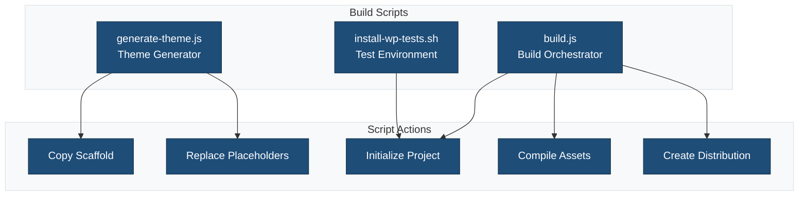
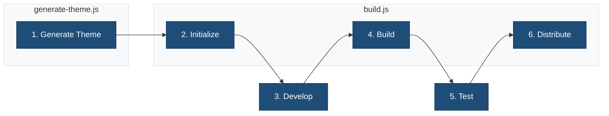

# Build Scripts

This directory contains build and generation scripts for the block theme scaffold.

## Overview



## Scripts

### `generate-theme.js`

Generates a new theme from the scaffold template by replacing mustache placeholders with provided values.

**Usage:**

```bash
node bin/generate-theme.js \
  --slug my-theme \
  --name "My Theme" \
  --description "A custom block theme" \
  --author "Your Name" \
  --author_uri "https://example.com" \
  --version "1.0.0"
```

**Arguments:**

| Argument | Required | Description |
|----------|----------|-------------|
| `--slug` | Yes | Theme slug (kebab-case) |
| `--name` | No | Theme display name |
| `--description` | No | Theme description |
| `--author` | No | Author name |
| `--author_uri` | No | Author website URL |
| `--version` | No | Theme version |

### `build.js`

Orchestrates the build process for the generated theme.

**Commands:**

```bash
# Initialize project (install dependencies)
node bin/build.js init

# Build assets for production
node bin/build.js build

# Build with stats for bundle analyzer
node bin/build.js build --stats

# Create distribution ZIP
node bin/build.js dist

# Run all checks (lint, test)
node bin/build.js check

# Run performance checks
node bin/build.js performance
```

### `install-wp-tests.sh`

Sets up the WordPress test environment for PHPUnit testing.

**Usage:**

```bash
./bin/install-wp-tests.sh <db-name> <db-user> <db-pass> [db-host] [wp-version]
```

**Example:**

```bash
./bin/install-wp-tests.sh wordpress_test root '' localhost latest
```

## Script Flow



## Related Documentation

- [Theme Generation Guide](../docs/GENERATE-THEME.md)
- [Build Process](../docs/BUILD-PROCESS.md)
- [Contributing Guidelines](../CONTRIBUTING.md)
