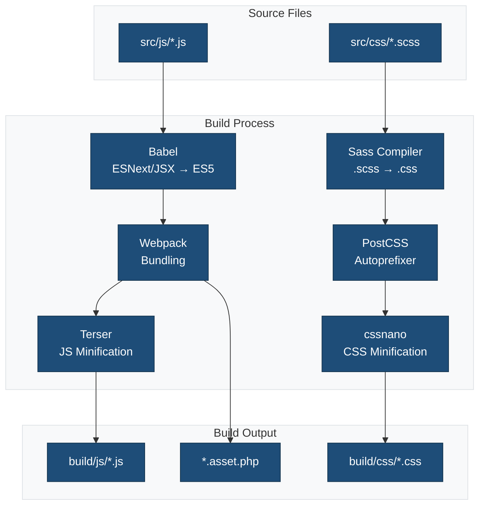
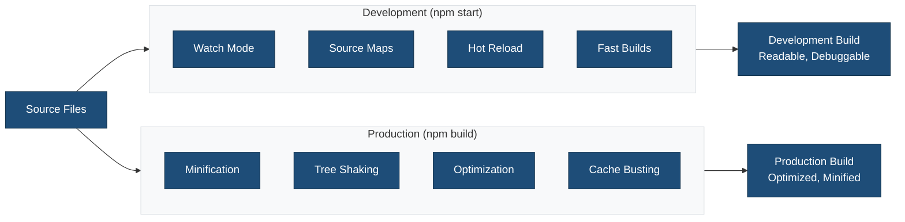

## Overview

This WordPress block theme uses `@wordpress/scripts` (wp-scripts) for its build process. wp-scripts provides a standardized toolchain that handles all aspects of modern theme development:

| Feature | Description | Tool |
|---------|-------------|------|
| **Compilation** | Converts ESNext and JSX into browser-compatible JavaScript | Babel |
| **Bundling** | Combines multiple files into optimized bundles | Webpack |
| **Code Linting** | Enforces JavaScript and CSS coding standards | ESLint, Stylelint |
| **Code Formatting** | Maintains consistent code style | Prettier |
| **Sass Compilation** | Converts .scss files to standard CSS | sass-loader |
| **Code Minification** | Reduces file sizes for production | Terser (JS), cssnano (CSS) |

For more details, see the official WordPress documentation:

- [Build Process](https://developer.wordpress.org/themes/advanced-topics/build-process/)
- [Get started with wp-scripts](https://developer.wordpress.org/block-editor/getting-started/devenv/get-started-with-wp-scripts/)

### Build Process Flow



## Prerequisites

- Node.js 18.0+ and npm 9.0+
- PHP 8.0+
- WordPress 6.4+

## Quick Start

```bash
# Install dependencies
npm install
composer install

# Start development mode with hot reload
npm run start

# Build for production
npm run build
```

## Build Scripts

### Development

```bash
npm run start
```

Starts webpack in development mode with:

- Hot module replacement (HMR)
- Source maps for debugging
- File watching for auto-rebuild
- Development-optimized bundles

### Production Build

```bash
npm run build
```

Creates optimized production assets:

- Minified JavaScript and CSS
- Optimized images and fonts
- Tree-shaking for smaller bundle sizes
- Cache-friendly filenames

```bash
npm run build:production
```

Same as `npm run build` but with explicit NODE_ENV=production flag.

### Development vs Production Flow



## Build Configuration

### Webpack Configuration (`webpack.config.cjs`)

The webpack config extends `@wordpress/scripts` defaults with custom settings:

**Entry Points:**

- `theme.js` - Main theme JavaScript
- `editor.js` - Block editor JavaScript
- `style.scss` - Frontend styles
- `editor.scss` - Editor-only styles

**Output:**

- Directory: `build/`
- JavaScript: `build/js/[name].js`
- CSS: `build/css/[name].css`
- Images: `build/images/`
- Fonts: `build/fonts/`

**Key Plugins:**

- `webpack-remove-empty-scripts` - Removes empty .js files from CSS-only entry points
- `@wordpress/dependency-extraction-webpack-plugin` - Extracts WordPress dependencies

**Path Aliases:**

- `@` → `src/` directory
- `@css` → `src/css/` directory
- `@js` → `src/js/` directory

**Asset Handling:**

- Images (png, jpg, gif, svg) → `build/images/`
- Fonts (woff, woff2, eot, ttf, otf) → `build/fonts/`
- SCSS compiled to CSS with PostCSS processing
- Automatic vendor prefixing
- CSS minification and optimization

### Source Structure

```
src/
├── css/
│   ├── style.scss          # Main stylesheet (frontend)
│   └── editor.scss         # Editor stylesheet
└── js/
    ├── theme.js            # Main JavaScript (frontend)
    └── editor.js           # Editor JavaScript
```

### Build Output

```
build/
├── css/
│   ├── style.css           # Compiled frontend CSS
│   ├── style.asset.php     # Dependency metadata
│   ├── editor-style.css    # Compiled editor CSS
│   └── editor-style.asset.php
├── js/
│   ├── theme.js            # Compiled frontend JS
│   ├── theme.asset.php     # Dependency metadata
│   ├── editor.js           # Compiled editor JS
│   └── editor.asset.php
├── images/                 # Optimized images
└── fonts/                  # Font files
```

## Asset Loading

The theme automatically loads compiled assets using WordPress dependency system:

### Frontend Assets (`functions.php`)

```php
wp_enqueue_style( 'theme-slug-style', get_theme_file_uri( 'build/css/style.css' ) );
wp_enqueue_script( 'theme-slug-script', get_theme_file_uri( 'build/js/theme.js' ) );
```

### Editor Assets

```php
wp_enqueue_style( 'theme-slug-editor-style', get_theme_file_uri( 'build/css/editor-style.css' ) );
```

## Internationalization (i18n)

### Generate Translation Template

```bash
npm run makepot
```

This creates `languages/{{theme_slug}}.pot` file containing all translatable strings.

### Translation Setup

1. **Text Domain:** All strings use `{{theme_slug}}` text domain
2. **Load Translations:** Handled in `functions.php`:

   ```php
   load_theme_textdomain( '{{theme_slug}}', get_template_directory() . '/languages' );
   ```

3. **Translation Files:** Place `.po` and `.mo` files in `languages/` directory

### Using Translations in Code

**PHP:**

```php
<?php esc_html_e( 'Text to translate', '{{theme_slug}}' ); ?>
<?php esc_html_x( 'Text', 'context', '{{theme_slug}}' ); ?>
<?php printf( esc_html__( 'Hello %s', '{{theme_slug}}' ), $name ); ?>
```

**JavaScript:**

```javascript
import { __ } from '@wordpress/i18n';

const text = __( 'Text to translate', '{{theme_slug}}' );
```

**Block Patterns (PHP):**

```php
<?php esc_html_e( 'Pattern text', '{{theme_slug}}' ); ?>
<?php echo esc_html_x( 'Text', 'Context', '{{theme_slug}}' ); ?>
```

## Linting and Formatting

### JavaScript Linting

```bash
npm run lint:js          # Check JS files
npm run lint:js:fix      # Auto-fix JS issues
```

### CSS Linting

```bash
npm run lint:css         # Check CSS/SCSS files
npm run lint:css:fix     # Auto-fix CSS issues
```

### PHP Linting

```bash
npm run lint:php         # Check PHP files (via Composer)
npm run lint:php:fix     # Auto-fix PHP issues
```

### Format All Files

```bash
npm run format           # Format with Prettier
```

## Testing

```bash
npm run test             # Run all tests
npm run test:js          # JavaScript unit tests
npm run test:js:watch    # Watch mode
npm run test:php         # PHP unit tests
npm run test:e2e         # End-to-end tests
```

## WordPress Environment

### Local Development

```bash
npm run env:start        # Start WordPress environment
npm run env:stop         # Stop environment
npm run env:destroy      # Remove environment
```

Access at:

- Site: <http://localhost:8888>
- Admin: <http://localhost:8888/wp-admin>
- Username: `admin`
- Password: `password`

## Performance Optimization

### Code Splitting

Webpack automatically splits code into optimized chunks:

- Separate bundles for editor and frontend
- Vendor code split from theme code
- CSS extracted into separate files

### Asset Optimization

- **Images:** Compressed and optimized during build
- **Fonts:** Subsetting for smaller file sizes
- **CSS:** Minified, autoprefixed, and purged of unused styles
- **JavaScript:** Minified, tree-shaken, and bundled efficiently

### Caching

Asset files include version hashes for cache busting:

- `theme.asset.php` contains dependency info and version
- WordPress automatically handles cache invalidation

## Troubleshooting

### Build Fails

```bash
# Clear caches
rm -rf node_modules build
npm install
npm run build
```

### Hot Reload Not Working

1. Check webpack-dev-server is running (`npm run start`)
2. Verify proxy settings in `.wp-env.json`
3. Clear browser cache

### Translation Strings Not Showing

1. Regenerate POT file: `npm run makepot`
2. Ensure text domain matches theme slug
3. Check `load_theme_textdomain()` is called in `functions.php`

### Asset 404 Errors

1. Verify build directory exists: `npm run build`
2. Check paths in `functions.php` match output directory
3. Ensure `.asset.php` files are generated

## References

- [WordPress Scripts Package](https://developer.wordpress.org/block-editor/reference-guides/packages/packages-scripts/)
- [WordPress Theme Build Process](https://developer.wordpress.org/themes/advanced-topics/build-process/)
- [WordPress Internationalization](https://developer.wordpress.org/themes/advanced-topics/internationalization/)
- [Block Theme Development](https://developer.wordpress.org/themes/block-themes/)
