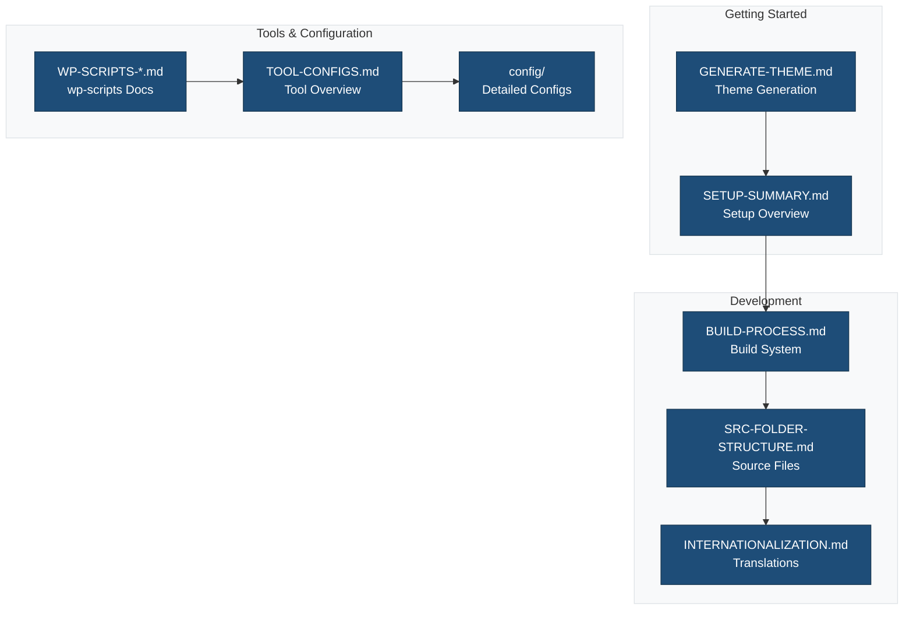
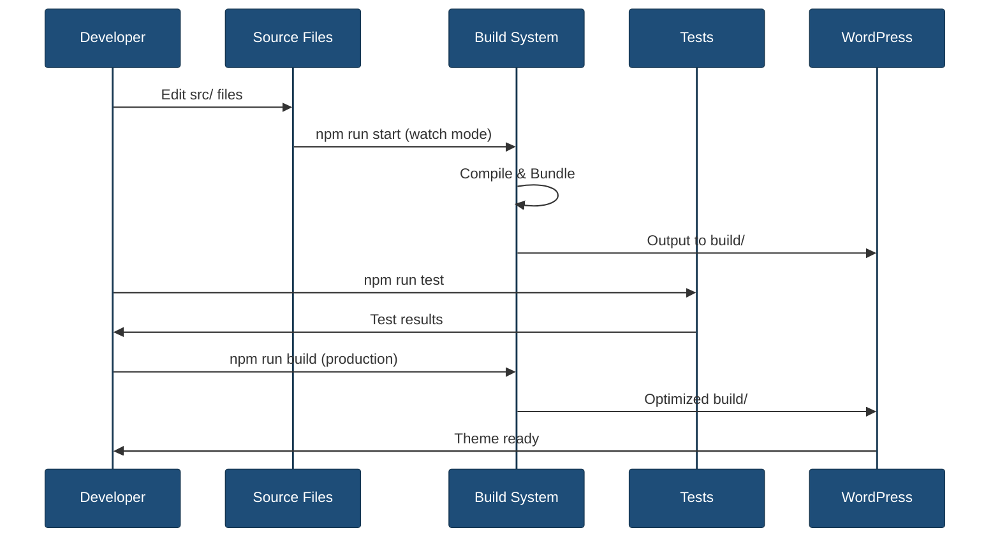
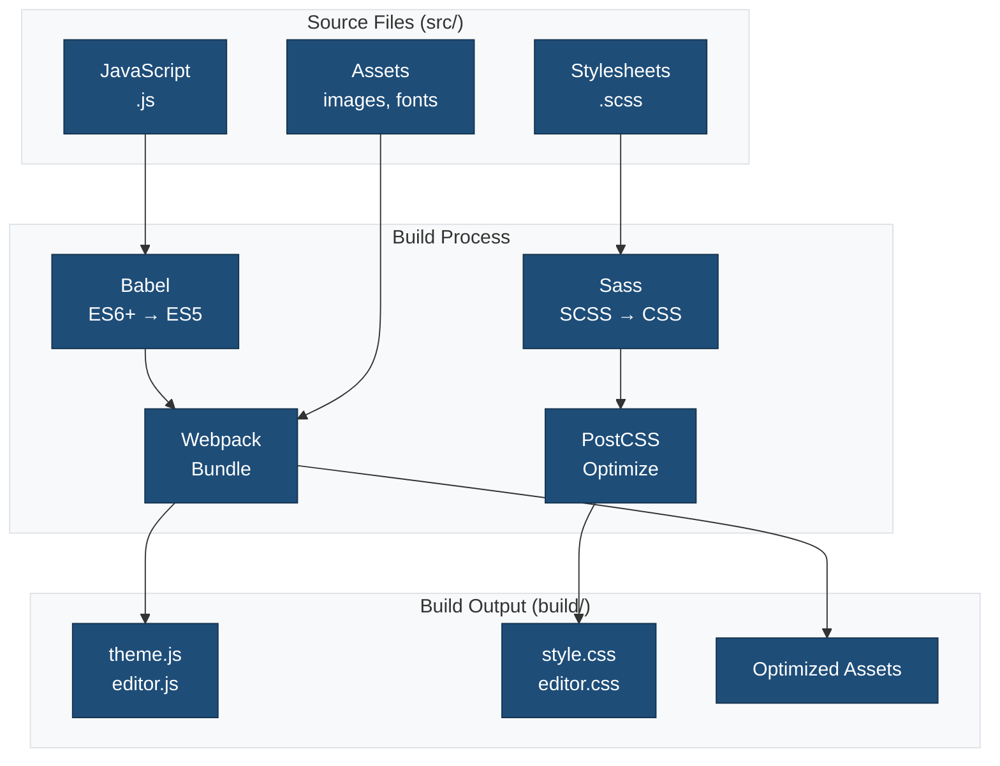
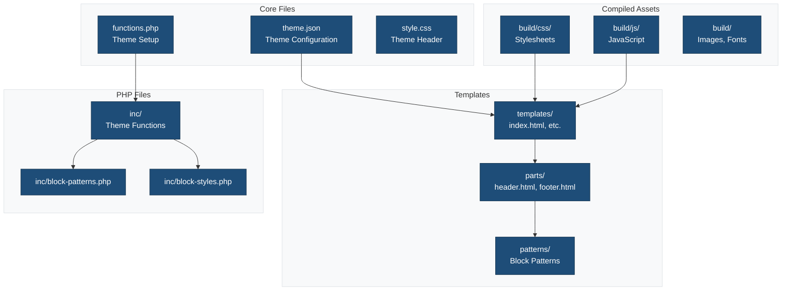

# Documentation

Comprehensive documentation for the {{theme_name}} block theme scaffold.

## Overview



## Quick Start

New to this scaffold? Start here:

1. 📖 [Theme Generation Guide](./GENERATE-THEME.md) - How to create a theme from this scaffold
2. 🎯 [Setup Summary](./SETUP-SUMMARY.md) - Overview of what's configured
3. 🏗️ [Build Process](./BUILD-PROCESS.md) - Understanding the build system

## Documentation Structure

### Getting Started

| Document | Description |
|----------|-------------|
| [GENERATE-THEME.md](./GENERATE-THEME.md) | Complete guide to generating a theme from this scaffold |
| [SETUP-SUMMARY.md](./SETUP-SUMMARY.md) | Overview of completed setup tasks and configurations |

### Development Guides

| Document | Description |
|----------|-------------|
| [BUILD-PROCESS.md](./BUILD-PROCESS.md) | Complete build process documentation with webpack, Babel, and asset compilation |
| [SRC-FOLDER-STRUCTURE.md](./SRC-FOLDER-STRUCTURE.md) | Source directory structure and file organization |
| [INTERNATIONALIZATION.md](./INTERNATIONALIZATION.md) | Translation and localization guide |

### wp-scripts Documentation

Detailed documentation for `@wordpress/scripts` build system:

| Document | Description |
|----------|-------------|
| [WP-SCRIPTS-SUMMARY.md](./WP-SCRIPTS-SUMMARY.md) | Overview of wp-scripts configuration and features |
| [WP-SCRIPTS-CONFIGURATION.md](./WP-SCRIPTS-CONFIGURATION.md) | Complete configuration guide for wp-scripts |
| [WP-SCRIPTS-QUICK-REFERENCE.md](./WP-SCRIPTS-QUICK-REFERENCE.md) | Quick reference for common commands and patterns |

### Tool Configuration

| Document | Description |
|----------|-------------|
| [TOOL-CONFIGS.md](./TOOL-CONFIGS.md) | Overview of all development tools and their purposes |
| [config/](./config/) | Detailed configuration guides for individual tools |

## Configuration Files

The `config/` directory contains detailed documentation for each tool:

```mermaid
%%{init: {'theme': 'base', 'themeVariables': { 'primaryColor': '#1e4d78', 'primaryTextColor': '#ffffff', 'primaryBorderColor': '#15354f', 'lineColor': '#333333', 'secondaryColor': '#f0f0f0', 'tertiaryColor': '#e8e8e8', 'background': '#ffffff', 'mainBkg': '#1e4d78', 'textColor': '#333333', 'nodeBorder': '#15354f', 'clusterBkg': '#f8f9fa', 'clusterBorder': '#dee2e6', 'titleColor': '#333333'}}}%%
flowchart LR
    subgraph Build["Build Tools"]
        Webpack["webpack.md"]
        Babel["babel.md"]
        PostCSS["postcss.md"]
    end

    subgraph Quality["Code Quality"]
        ESLint["eslint.md"]
        Stylelint["stylelint.md"]
        Prettier["prettier.md"]
        NPMLint["npm-package-json-lint.md"]
    end

    subgraph Testing["Testing Tools"]
        Jest["jest.md"]
        Playwright["playwright.md"]
    end

    Build --> Quality
    Quality --> Testing
```



### Available Configuration Guides

- [babel.md](./config/babel.md) - Babel transpilation configuration
- [eslint.md](./config/eslint.md) - JavaScript linting rules
- [jest.md](./config/jest.md) - JavaScript testing configuration
- [npm-package-json-lint.md](./config/npm-package-json-lint.md) - Package.json validation
- [playwright.md](./config/playwright.md) - End-to-end testing setup
- [postcss.md](./config/postcss.md) - CSS processing and optimization
- [prettier.md](./config/prettier.md) - Code formatting rules
- [stylelint.md](./config/stylelint.md) - CSS/SCSS linting configuration
- [webpack.md](./config/webpack.md) - Module bundling configuration

## Common Tasks

### Development Workflow

```bash
# Install dependencies
npm install

# Start development server with watch mode
npm run start

# Build for production
npm run build
```

### Code Quality

```bash
# Lint JavaScript
npm run lint:js

# Lint CSS/SCSS
npm run lint:css

# Format all files
npm run format

# Run all linters
npm run lint
```

### Testing

```bash
# Run all tests
npm run test

# JavaScript unit tests
npm run test:js

# End-to-end tests
npm run test:e2e

# PHP tests
npm run test:php
```

### Internationalization

```bash
# Generate .pot file for translations
npm run makepot

# Generate JSON translations for JavaScript
npm run make-json
```

## Development Flow



## Build System Architecture



## Theme Architecture



## Prerequisites

- **Node.js**: 18.0+ and npm 9.0+
- **PHP**: 8.0+
- **WordPress**: 6.4+
- **Composer**: 2.0+ (for PHP dependencies)

## Support Resources

### Official WordPress Documentation

- [Block Theme Handbook](https://developer.wordpress.org/themes/block-themes/)
- [Block Editor Handbook](https://developer.wordpress.org/block-editor/)
- [Theme Developer Handbook](https://developer.wordpress.org/themes/)
- [@wordpress/scripts Documentation](https://developer.wordpress.org/block-editor/reference-guides/packages/packages-scripts/)

### WordPress Packages

- [@wordpress/scripts](https://www.npmjs.com/package/@wordpress/scripts)
- [@wordpress/eslint-plugin](https://www.npmjs.com/package/@wordpress/eslint-plugin)
- [@wordpress/stylelint-config](https://www.npmjs.com/package/@wordpress/stylelint-config)

## Contributing

When contributing to this scaffold:

1. Follow WordPress coding standards
2. Update relevant documentation
3. Test with the generation script
4. Ensure all linters pass
5. Update version numbers appropriately

## License

This scaffold is licensed under {{license}}. Generated themes inherit this license unless modified.

## Related Documentation

- [Main README](../README.md) - Repository root documentation
- [Source Directory](../src/README.md) - Source files documentation
- [Tests Directory](../tests/README.md) - Testing documentation
- [Build Scripts](../bin/README.md) - Build script documentation
