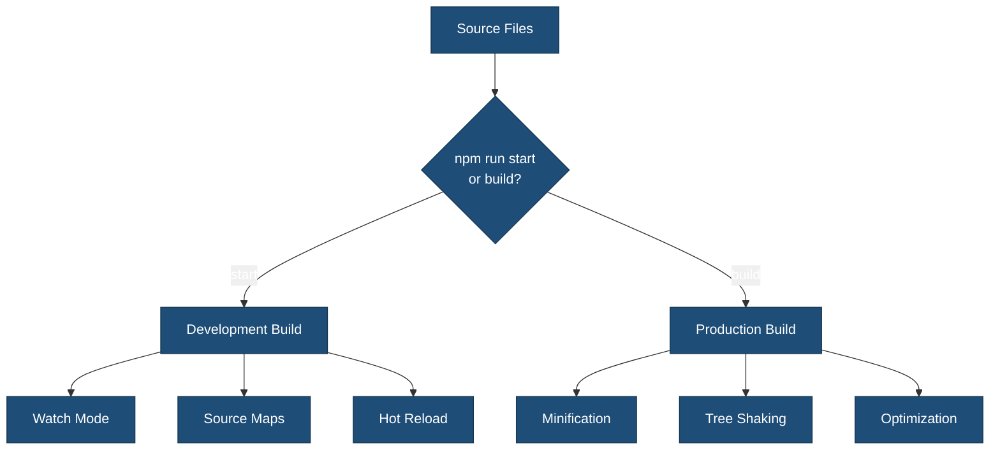

# wp-scripts Quick Reference

Quick reference guide for using `@wordpress/scripts` in the {{theme_name}} block theme.

## Build Commands

```bash
# Development (watch mode, hot reload)
npm run start

# Production build (minified, optimized)
npm run build

# Alternative production build
npm run build:production
```

## What Gets Built?

### Source Files → Build Files

| Source | Output |
|--------|--------|
| `src/js/theme.js` | `build/js/theme.js` + `build/js/theme.asset.php` |
| `src/js/editor.js` | `build/js/editor.js` + `build/js/editor.asset.php` |
| `src/css/style.scss` | `build/css/style.css` + `build/css/style.asset.php` |
| `src/css/editor.scss` | `build/css/editor-style.css` + `build/css/editor-style.asset.php` |

## Build Process Features

### Build Flow



### ✅ 1. Compilation (Babel)

Converts modern JavaScript (ESNext, JSX) to browser-compatible code.

**Example**:

```javascript
// Source (src/js/theme.js)
const greeting = (name) => `Hello, ${name}!`;

// Output (build/js/theme.js) - compatible with older browsers
var greeting = function(name) { return "Hello, " + name + "!"; };
```

**Configuration**: Automatic via `@wordpress/babel-preset-default`

### ✅ 2. Bundling (webpack)

Combines multiple files into single bundles.

**Example**:

```javascript
// src/js/theme.js
import Header from './components/Header';
import Footer from './components/Footer';
import './utils/helpers';

// All combined into → build/js/theme.js
```

**Configuration**: `webpack.config.cjs`

### ✅ 3. Sass Compilation

Converts `.scss` to standard CSS.

**Example**:

```scss
// Source (src/css/style.scss)
$primary: #0073aa;
.button { background: $primary; }

// Output (build/css/style.css)
.button { background: #0073aa; }
```

**Configuration**: Automatic, processed with PostCSS

### ✅ 4. Code Minification

**Development** (`npm run start`):

- Readable code
- Source maps included
- No minification

**Production** (`npm run build`):

- Minified JavaScript (Terser)
- Minified CSS (cssnano)
- 60-70% size reduction

### ✅ 5. Code Linting (ESLint)

```bash
# Check JavaScript code quality
npm run lint:js

# Auto-fix issues
npm run lint:js:fix
```

**Checks for**:

- Syntax errors
- Code quality issues
- WordPress coding standards
- React best practices

**Configuration**: `.eslint.config.cjs`

### ✅ 6. Code Formatting (Prettier)

```bash
# Format all files
npm run format
```

**Formats**:

- JavaScript (.js, .jsx)
- CSS/Sass (.css, .scss)
- JSON files
- Markdown files

**Configuration**: `@wordpress/prettier-config` (automatic)

## Linting & Formatting

```bash
# JavaScript
npm run lint:js          # Check
npm run lint:js:fix      # Fix

# CSS/Sass
npm run lint:css         # Check
npm run lint:css:fix     # Fix

# PHP
npm run lint:php         # Check
npm run lint:php:fix     # Fix

# Format all
npm run format           # Prettier
```

## Testing

```bash
# All tests
npm run test

# JavaScript unit tests
npm run test:js
npm run test:js:watch    # Watch mode

# End-to-end tests
npm run test:e2e

# PHP tests
npm run test:php
```

## WordPress Packages

Import WordPress packages directly:

```javascript
// React-like components
import { useState, useEffect } from '@wordpress/element';

// Data management
import { useSelect, useDispatch } from '@wordpress/data';

// UI Components
import { Button, Modal } from '@wordpress/components';

// Translations
import { __ } from '@wordpress/i18n';
const text = __( 'Hello', '{{theme_slug}}' );

// API
import apiFetch from '@wordpress/api-fetch';

// Block Editor
import { BlockControls } from '@wordpress/block-editor';
```

**No manual enqueuing needed** - dependencies automatically added to `.asset.php`.

## Asset Files (.asset.php)

Each compiled file gets an `.asset.php` file:

```php
// build/js/theme.asset.php
<?php return array(
 'dependencies' => array(
  'wp-element',
  'wp-i18n',
  'wp-polyfill',
 ),
 'version' => 'a1b2c3d4e5f6'
);
```

**Use in theme**:

```php
$asset = include get_theme_file_path( 'build/js/theme.asset.php' );

wp_enqueue_script(
 '{{theme_slug}}-script',
 get_theme_file_uri( 'build/js/theme.js' ),
 $asset['dependencies'],  // Auto-includes WordPress deps
 $asset['version']        // Auto cache-busting
);
```

## Configuration Files

| File | Purpose |
|------|---------|
| `webpack.config.cjs` | webpack configuration (entry points, output, loaders) |
| `.browserslistrc` | Target browsers for Babel and autoprefixer |
| `.postcss.config.cjs` | PostCSS plugins (autoprefixer, cssnano) |
| `.eslint.config.cjs` | ESLint rules for JavaScript linting |
| `.stylelint.config.cjs` | Stylelint rules for CSS/Sass linting |
| `package.json` | npm scripts and dependencies |

## Development Workflow

### 1. Start Development

```bash
npm run start
```

### 2. Edit Files

```
src/
├── css/
│   ├── style.scss      ← Edit
│   └── editor.scss     ← Edit
└── js/
    ├── theme.js        ← Edit
    └── editor.js       ← Edit
```

### 3. Auto-compile

Files automatically rebuild on save.

### 4. Test Locally

View changes in WordPress.

### 5. Production Build

```bash
npm run build
```

## Common Tasks

### Add New JavaScript File

1. **Create**: `src/js/custom.js`
2. **Configure**: Add to `webpack.config.cjs` entry points:

   ```javascript
   entry: {
     'js/custom': './src/js/custom.js',
   }
   ```

3. **Build**: `npm run build`
4. **Enqueue**: Add to `functions.php`

### Add New Sass File

1. **Create**: `src/css/custom.scss`
2. **Import**: In `src/css/style.scss`:

   ```scss
   @import 'custom';
   ```

3. **Build**: Automatically included

### Use Path Aliases

Instead of:

```javascript
import Header from '../../../components/Header';
```

Use:

```javascript
import Header from '@js/components/Header';
```

Configured in `webpack.config.cjs`:

```javascript
alias: {
 '@': path.resolve( __dirname, 'src' ),
 '@js': path.resolve( __dirname, 'src/js' ),
 '@css': path.resolve( __dirname, 'src/css' ),
}
```

## Troubleshooting

### Build Fails

```bash
rm -rf node_modules build
npm install
npm run build
```

### Changes Not Detected

Restart watch mode:

```bash
# Stop (Ctrl+C)
npm run start
```

### Asset Not Found

```bash
npm run build  # Ensure build directory exists
```

### Linting Errors

```bash
npm run lint:js:fix
npm run lint:css:fix
npm run format
```

## File Size Guidelines

**Development** (`npm run start`):

```
build/js/theme.js: ~150 KB
build/css/style.css: ~50 KB
```

**Production** (`npm run build`):

```
build/js/theme.js: ~45 KB (70% smaller)
build/css/style.css: ~15 KB (70% smaller)
```

## Browser Support

Based on `.browserslistrc`:

- Chrome (last 2 versions)
- Firefox (last 2 versions)
- Safari (last 2 versions)
- Edge (last 2 versions)
- Browsers with >0.5% market share

Modern features are automatically transpiled/polyfilled.

## Performance Tips

### 1. Code Splitting

Separate entry points for frontend and editor:

```javascript
entry: {
 'js/theme': './src/js/theme.js',    // Frontend only
 'js/editor': './src/js/editor.js',  // Editor only
}
```

### 2. Dynamic Imports

```javascript
// Instead of:
import HeavyComponent from './HeavyComponent';

// Use:
const HeavyComponent = () => import('./HeavyComponent');
```

### 3. Tree Shaking

Only import what you need:

```javascript
// ❌ Imports entire library
import _ from 'lodash';

// ✅ Imports only what's needed
import { debounce } from 'lodash';
```

### 4. External Dependencies

Mark large libraries as external (use WordPress versions):

```javascript
externals: {
 jquery: 'jQuery',
 lodash: 'lodash',
}
```

## Quick Commands Summary

```bash
# Build
npm run start              # Dev with watch
npm run build              # Production

# Quality
npm run lint               # All linting
npm run lint:js:fix        # Fix JS
npm run lint:css:fix       # Fix CSS
npm run format             # Format all

# Test
npm run test               # All tests
npm run test:js:watch      # Watch JS tests
npm run test:e2e           # E2E tests

# Internationalization
npm run makepot            # Generate .pot
npm run i18n               # Generate all i18n files

# Maintenance
npm run packages-update    # Update packages
npm install                # Install deps
```

## Resources

- [wp-scripts Documentation](https://developer.wordpress.org/block-editor/reference-guides/packages/packages-scripts/)
- [WordPress Packages](https://developer.wordpress.org/block-editor/reference-guides/packages/)
- [Theme Build Process](https://developer.wordpress.org/themes/advanced-topics/build-process/)
- [WordPress Coding Standards](https://developer.wordpress.org/coding-standards/)

---

**Need more details?** See `docs/WP-SCRIPTS-CONFIGURATION.md` for comprehensive documentation.
