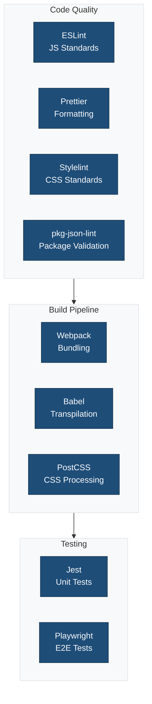

This directory contains comprehensive documentation for all configuration files used in the block theme scaffold.

## Overview

The block theme scaffold uses multiple configuration tools to maintain code quality, consistency, and compatibility with WordPress standards. Each configuration file is documented separately with detailed explanations, usage examples, and best practices.

## Configuration Files

### Code Quality & Linting

1. **[ESLint](./eslint.md)** - JavaScript linting
   - File: `.eslint.config.cjs`
   - Package: `@wordpress/eslint-plugin@^22.21.0`
   - Purpose: Enforces JavaScript coding standards

2. **[Prettier](./prettier.md)** - Code formatting
   - Configuration: `package.json` (extends `@wordpress/prettier-config`)
   - Package: `@wordpress/prettier-config@^4.35.0`
   - Purpose: Ensures consistent code formatting

3. **[Stylelint](./stylelint.md)** - CSS/SCSS linting
   - File: `.stylelint.config.cjs`
   - Package: `@wordpress/stylelint-config@^23.27.0`
   - Purpose: Enforces CSS/SCSS coding standards

4. **[npm-package-json-lint](./npm-package-json-lint.md)** - package.json validation
   - File: `.npmpackagejsonlintrc.json`
   - Purpose: Validates package.json structure and metadata

### Build & Transform

5. **[Webpack](./webpack.md)** - Module bundler
   - File: `webpack.config.cjs`
   - Package: `@wordpress/scripts@^31.0.0`
   - Purpose: Bundles JavaScript, CSS, and assets

6. **[Babel](./babel.md)** - JavaScript compiler
   - Configuration: Integrated in webpack
   - Package: `@wordpress/babel-preset-default@^8.35.0`
   - Purpose: Transpiles modern JavaScript to compatible code

7. **[PostCSS](./postcss.md)** - CSS processor
   - File: `.postcss.config.cjs`
   - Plugins: autoprefixer, cssnano
   - Purpose: Adds vendor prefixes and optimizes CSS

### Testing

8. **[Jest](./jest.md)** - Unit testing
   - File: `.jest.config.cjs`
   - Package: `@wordpress/jest-preset-default@^12.35.0`
   - Purpose: JavaScript unit and integration testing

9. **[Playwright](./playwright.md)** - End-to-end testing
   - File: `.playwright.config.cjs`
   - Package: `@wordpress/e2e-test-utils-playwright@^1.35.0`
   - Purpose: Browser automation and E2E testing

## Quick Reference

### Available Scripts

```bash
# Development
npm run start                 # Start development mode with watch

# Building
npm run build                 # Production build

# Linting
npm run lint:js              # Lint JavaScript
npm run lint:js:fix          # Fix JavaScript issues
npm run lint:css             # Lint CSS/SCSS
npm run lint:css:fix         # Fix CSS issues
npm run lint:php             # Lint PHP
npm run lint:pkg-json        # Lint package.json

# Formatting
npm run format               # Format all files with Prettier

# Testing
npm run test:js              # Run Jest tests
npm run test:js:watch        # Run Jest in watch mode
npm run test:e2e             # Run Playwright E2E tests
npm run test:php             # Run PHPUnit tests

# Internationalization
npm run makepot              # Generate .pot translation file
npm run makejson             # Generate block.json translations

# Environment
npm run env:start            # Start wp-env
npm run env:stop             # Stop wp-env
npm run env:destroy          # Destroy wp-env
```

## Configuration Hierarchy



```
Root
├── Code Quality
│   ├── ESLint          → JavaScript quality
│   ├── Prettier        → Code formatting
│   ├── Stylelint       → CSS quality
│   └── pkg-json-lint   → Package metadata
│
├── Build Pipeline
│   ├── Webpack         → Bundling orchestration
│   ├── Babel           → JS transpilation
│   └── PostCSS         → CSS processing
│
└── Testing
    ├── Jest            → Unit tests
    └── Playwright      → E2E tests
```

## WordPress Packages

All configuration extends WordPress official packages:

- `@wordpress/scripts` - Main tooling package
- `@wordpress/eslint-plugin` - JavaScript standards
- `@wordpress/prettier-config` - Formatting standards
- `@wordpress/stylelint-config` - CSS standards
- `@wordpress/babel-preset-default` - JS transpilation
- `@wordpress/postcss-plugins-preset` - CSS processing
- `@wordpress/postcss-themes` - Theme-specific CSS features
- `@wordpress/jest-preset-default` - Testing standards
- `@wordpress/e2e-test-utils-playwright` - E2E utilities
- `@wordpress/browserslist-config` - Browser support targets

## Browser Support

All tools target the same browsers via `@wordpress/browserslist-config`:

- Last 2 versions of major browsers
- IE 11+ (with polyfills)
- Safari 12+
- iOS 12+
- Android 4.4+

## VS Code Integration

Each configuration file has VS Code integration guidance. Install these extensions for the best experience:

- ESLint
- Prettier - Code formatter
- Stylelint
- Jest
- Playwright Test for VS Code

Add to `.vscode/settings.json`:

```json
{
  "editor.defaultFormatter": "esbenp.prettier-vscode",
  "editor.formatOnSave": true,
  "editor.codeActionsOnSave": {
    "source.fixAll.eslint": "explicit",
    "source.fixAll.stylelint": "explicit"
  },
  "eslint.validate": ["javascript", "javascriptreact"],
  "stylelint.validate": ["css", "scss"]
}
```

## Customization Guidelines

When customizing configurations:

1. **Start with WordPress defaults**: Always extend official WordPress packages
2. **Minimal overrides**: Only change what's necessary for your project
3. **Document changes**: Comment why rules are modified or disabled
4. **Test thoroughly**: Ensure changes don't break the build or tests
5. **Keep updated**: Regularly update WordPress packages
6. **Share with team**: Ensure all team members use the same configuration

## Common Workflows

### Setting up a new theme

```bash
npm install                   # Install dependencies
npm run build                 # Initial build
npm run env:start            # Start WordPress environment
npm run start                # Start development mode
```

### Before committing

```bash
npm run lint:js:fix          # Fix JavaScript issues
npm run lint:css:fix         # Fix CSS issues
npm run format               # Format all files
npm run test:js              # Run unit tests
```

### Production deployment

```bash
npm run lint:js              # Verify JavaScript
npm run lint:css             # Verify CSS
npm run lint:php             # Verify PHP
npm run test:js              # Run unit tests
npm run test:e2e             # Run E2E tests
npm run build                # Build optimized assets
```

## Troubleshooting

If you encounter configuration issues:

1. **Check Node version**: Ensure you're using Node 18+ (check `.nvmrc`)
2. **Clear caches**: Delete `node_modules` and `package-lock.json`, then reinstall
3. **Update packages**: Run `npm update` to get latest compatible versions
4. **Check file paths**: Ensure all configuration files are in the correct locations
5. **Review error messages**: Most tools provide detailed error messages
6. **Consult documentation**: Each config file has its own detailed documentation

## Additional Resources

- [WordPress Block Editor Handbook](https://developer.wordpress.org/block-editor/)
- [WordPress Coding Standards](https://developer.wordpress.org/coding-standards/)
- [WordPress Developer Resources](https://developer.wordpress.org/)
- [@wordpress/scripts Documentation](https://developer.wordpress.org/block-editor/reference-guides/packages/packages-scripts/)

## Contributing

When updating configuration:

1. Test changes thoroughly
2. Update relevant documentation
3. Follow WordPress coding standards
4. Document breaking changes
5. Update this README if adding new configs

## Support

For questions or issues:

- Check individual configuration documentation files
- Review WordPress Developer Handbook
- Consult package-specific documentation
- Check GitHub issues for known problems
