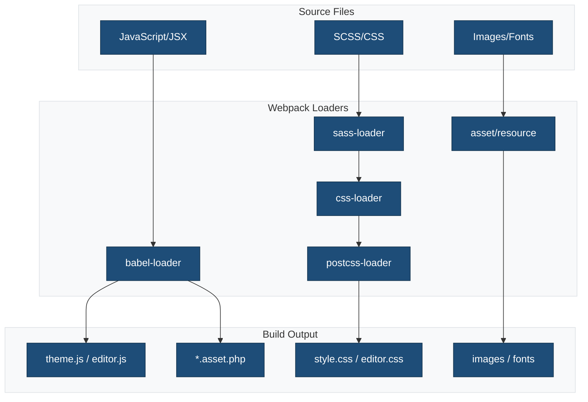

# Webpack Configuration

## Overview

Webpack is the module bundler that processes JavaScript, CSS, and assets. This theme extends `@wordpress/scripts` webpack configuration with custom settings for internationalization, path aliases, and optimized bundling.

## Configuration File

Location: `webpack.config.cjs`

### Processing Flow



## WordPress Packages Used

- `@wordpress/scripts` - ^31.0.0
- `@wordpress/babel-preset-default` - ^8.35.0
- `@wordpress/babel-plugin-makepot` - ^6.35.0

## Configuration

```javascript
const defaultConfig = require('@wordpress/scripts/config/webpack.config');
const path = require('path');

module.exports = {
  ...defaultConfig,

  entry: {
    theme: './src/js/theme.js',
    editor: './src/js/editor.js',
    style: './src/css/style.scss',
    'editor-style': './src/css/editor.scss',
  },

  output: {
    filename: 'js/[name].js',
    path: path.resolve(__dirname, 'public'),
    clean: true,
  },

  module: {
    rules: [
      ...defaultConfig.module.rules,
      {
        test: /\.jsx?$/,
        exclude: /node_modules/,
        use: {
          loader: 'babel-loader',
          options: {
            presets: ['@wordpress/babel-preset-default'],
            plugins: [
              [
                '@wordpress/babel-plugin-makepot',
                {
                  output: 'languages/{{theme_slug}}-js.pot',
                },
              ],
            ],
          },
        },
      },
    ],
  },

  resolve: {
    alias: {
      '@': path.resolve(__dirname, 'src'),
      '@css': path.resolve(__dirname, 'src/css'),
      '@js': path.resolve(__dirname, 'src/js'),
    },
    extensions: ['.js', '.jsx', '.json'],
  },

  optimization: {
    splitChunks: {
      cacheGroups: {
        style: {
          name: 'style',
          test: /style\.s?css$/,
          chunks: 'all',
          enforce: true,
        },
        editor: {
          name: 'editor',
          test: /editor\.s?css$/,
          chunks: 'all',
          enforce: true,
        },
      },
    },
  },
};
```

## Key Configuration Sections

### Entry Points

```javascript
entry: {
  theme: './src/js/theme.js',       // Frontend JavaScript
  editor: './src/js/editor.js',     // Editor JavaScript
  style: './src/css/style.scss',    // Frontend styles
  'editor-style': './src/css/editor.scss', // Editor styles
}
```

#### Purpose

- **theme.js**: Frontend JavaScript functionality
- **editor.js**: Block editor customizations
- **style.scss**: Theme frontend styles
- **editor.scss**: Block editor styles

### Output Configuration

```javascript
output: {
  filename: 'js/[name].js',           // JavaScript output pattern
  path: path.resolve(__dirname, 'public'), // Output directory
  clean: true,                        // Clean output folder before build
}
```

#### Output Structure

```
public/
├── js/
│   ├── theme.js
│   ├── editor.js
│   └── vendors.js (if code splitting)
└── css/
    ├── style.css
    └── editor.css
```

### Custom Babel Loader

```javascript
{
  test: /\.jsx?$/,
  exclude: /node_modules/,
  use: {
    loader: 'babel-loader',
    options: {
      presets: ['@wordpress/babel-preset-default'],
      plugins: [
        [
          '@wordpress/babel-plugin-makepot',
          {
            output: 'languages/theme-slug-js.pot',
          },
        ],
      ],
    },
  },
}
```

#### Features

- Transpiles ES6+ and JSX
- Extracts translatable strings to `.pot` file
- Excludes node_modules for performance

### Path Aliases

```javascript
resolve: {
  alias: {
    '@': path.resolve(__dirname, 'src'),
    '@css': path.resolve(__dirname, 'src/css'),
    '@js': path.resolve(__dirname, 'src/js'),
  },
  extensions: ['.js', '.jsx', '.json'],
}
```

#### Usage in Code

```javascript
// Instead of relative paths
import Header from '../../../components/Header';

// Use aliases
import Header from '@/components/Header';
import styles from '@css/components/header.scss';
import utils from '@js/utils/helpers';
```

### Code Splitting

```javascript
optimization: {
  splitChunks: {
    cacheGroups: {
      style: {
        name: 'style',
        test: /style\.s?css$/,
        chunks: 'all',
        enforce: true,
      },
      editor: {
        name: 'editor',
        test: /editor\.s?css$/,
        chunks: 'all',
        enforce: true,
      },
    },
  },
}
```

#### Purpose

- Separates frontend and editor styles
- Prevents style conflicts
- Optimizes loading performance

## @wordpress/scripts Default Config

### Included Features

- **JavaScript**: Babel transpilation with WordPress preset
- **CSS/SCSS**: PostCSS processing, autoprefixer, minification
- **Assets**: Image and font handling
- **Source Maps**: Development debugging
- **Hot Reload**: Fast development feedback
- **Optimization**: Minification and tree-shaking
- **WordPress Integration**: Handles WordPress dependencies

### Default Loaders

```javascript
// JavaScript/JSX
{ test: /\.jsx?$/, use: 'babel-loader' }

// CSS/SCSS
{ test: /\.s?css$/, use: ['style-loader', 'css-loader', 'postcss-loader', 'sass-loader'] }

// Images
{ test: /\.(png|jpe?g|gif|svg)$/i, type: 'asset/resource' }

// Fonts
{ test: /\.(woff|woff2|eot|ttf|otf)$/i, type: 'asset/resource' }
```

## Available Scripts

```bash
# Development mode (watch + hot reload)
npm run start

# Production build (optimized)
npm run build

# Build specific entry
npm run build -- --entry=theme

# Watch mode without hot reload
npm run start -- --no-hot
```

### Script Options

```bash
# Custom port for dev server
npm run start -- --port=3000

# Disable source maps
npm run build -- --devtool=false

# Webpack stats
npm run build -- --json > stats.json
```

## Customization

### Adding Custom Entry Point

```javascript
entry: {
  ...defaultConfig.entry,
  admin: './src/js/admin.js',
  login: './src/js/login.js',
}
```

### Custom Output Path

```javascript
output: {
  ...defaultConfig.output,
  path: path.resolve(__dirname, 'dist'),
  publicPath: '/wp-content/themes/theme-name/dist/',
}
```

### Environment Variables

```javascript
const webpack = require('webpack');

module.exports = {
  ...defaultConfig,
  plugins: [
    ...defaultConfig.plugins,
    new webpack.DefinePlugin({
      'process.env.THEME_VERSION': JSON.stringify('1.0.0'),
      'process.env.API_URL': JSON.stringify(process.env.API_URL),
    }),
  ],
};
```

#### Usage

```javascript
console.log(process.env.THEME_VERSION); // '1.0.0'
```

### Asset Handling

```javascript
module: {
  rules: [
    ...defaultConfig.module.rules,
    {
      test: /\.(png|svg|jpg|jpeg|gif)$/i,
      type: 'asset/resource',
      generator: {
        filename: 'images/[name][ext]',
      },
    },
    {
      test: /\.(woff|woff2|eot|ttf|otf)$/i,
      type: 'asset/resource',
      generator: {
        filename: 'fonts/[name][ext]',
      },
    },
  ],
}
```

### External Libraries

Exclude libraries from bundle (use WordPress versions):

```javascript
externals: {
  ...defaultConfig.externals,
  jquery: 'jQuery',
  lodash: 'lodash',
  react: 'React',
  'react-dom': 'ReactDOM',
}
```

## Development Mode

### Features

- Source maps for debugging
- Hot module replacement
- Faster builds (no minification)
- Verbose error messages

### Configuration

```javascript
// webpack.config.cjs
module.exports = (env, argv) => {
  const isProduction = argv.mode === 'production';

  return {
    ...defaultConfig,
    devtool: isProduction ? 'source-map' : 'eval-source-map',
    optimization: {
      minimize: isProduction,
    },
  };
};
```

## Production Mode

### Optimizations

- Minification (JavaScript and CSS)
- Tree shaking (remove unused code)
- Code splitting
- Asset optimization
- Source map generation

### Bundle Analysis

```bash
# Generate stats file
npm run build -- --json > stats.json

# Use webpack-bundle-analyzer
npx webpack-bundle-analyzer stats.json
```

## WordPress Integration

### Enqueuing Assets

```php
// functions.php
function theme_enqueue_assets() {
    $asset_file = include get_template_directory() . '/public/js/theme.asset.php';

    wp_enqueue_script(
        'theme-script',
        get_template_directory_uri() . '/public/js/theme.js',
        $asset_file['dependencies'],
        $asset_file['version'],
        true
    );

    wp_enqueue_style(
        'theme-style',
        get_template_directory_uri() . '/public/css/style.css',
        [],
        $asset_file['version']
    );
}
add_action('wp_enqueue_scripts', 'theme_enqueue_assets');
```

### Editor Assets

```php
function theme_enqueue_editor_assets() {
    $asset_file = include get_template_directory() . '/public/js/editor.asset.php';

    wp_enqueue_script(
        'theme-editor-script',
        get_template_directory_uri() . '/public/js/editor.js',
        $asset_file['dependencies'],
        $asset_file['version']
    );

    wp_enqueue_style(
        'theme-editor-style',
        get_template_directory_uri() . '/public/css/editor.css',
        [],
        $asset_file['version']
    );
}
add_action('enqueue_block_editor_assets', 'theme_enqueue_editor_assets');
```

## Performance Optimization

### Code Splitting

```javascript
optimization: {
  splitChunks: {
    chunks: 'all',
    cacheGroups: {
      vendor: {
        test: /[\\/]node_modules[\\/]/,
        name: 'vendors',
        priority: 10,
      },
      common: {
        minChunks: 2,
        priority: 5,
        reuseExistingChunk: true,
      },
    },
  },
}
```

### Lazy Loading

```javascript
// Import on demand
const module = await import('./module.js');

// React lazy loading
const Component = React.lazy(() => import('./Component'));
```

### Minimize Bundle Size

```javascript
optimization: {
  usedExports: true, // Tree shaking
  minimize: true,
  minimizer: [
    new TerserPlugin({
      terserOptions: {
        compress: {
          drop_console: true, // Remove console.log in production
        },
      },
    }),
  ],
}
```

## Debugging

### Enable Verbose Output

```bash
npm run build -- --progress --verbose
```

### Check Bundle Contents

```bash
# List all files in bundle
npm run build -- --display-modules

# Analyze bundle size
npm run build -- --json > stats.json
npx webpack-bundle-analyzer stats.json
```

### Source Maps

Development:

```javascript
devtool: 'eval-source-map' // Fast, detailed
```

Production:

```javascript
devtool: 'source-map' // Slower, accurate
```

## Common Issues

### Module Not Found

**Cause**: Incorrect path or missing alias

**Solution**: Check path aliases and file extensions:

```javascript
resolve: {
  alias: {
    '@': path.resolve(__dirname, 'src'),
  },
  extensions: ['.js', '.jsx', '.json'],
}
```

### Slow Build Times

**Causes**:

- Not excluding node_modules
- No caching
- Too many entry points

**Solutions**:

```javascript
// Exclude node_modules
{ test: /\.jsx?$/, exclude: /node_modules/ }

// Enable caching
{
  loader: 'babel-loader',
  options: {
    cacheDirectory: true,
  }
}
```

### Asset Path Issues

**Cause**: Incorrect publicPath

**Solution**:

```javascript
output: {
  publicPath: '/wp-content/themes/theme-name/public/',
}
```

### Memory Issues

**Solution**: Increase Node memory:

```json
{
  "scripts": {
    "build": "NODE_OPTIONS=--max-old-space-size=4096 wp-scripts build"
  }
}
```

## VS Code Integration

### Task Configuration

`.vscode/tasks.json`:

```json
{
  "version": "2.0.0",
  "tasks": [
    {
      "label": "Build Theme",
      "type": "npm",
      "script": "build",
      "problemMatcher": [],
      "group": {
        "kind": "build",
        "isDefault": true
      }
    },
    {
      "label": "Start Development",
      "type": "npm",
      "script": "start",
      "problemMatcher": [],
      "isBackground": true
    }
  ]
}
```

## Best Practices

1. **Extend WordPress Config**: Start with `@wordpress/scripts` defaults
2. **Use Path Aliases**: Simplify imports with `@` aliases
3. **Enable Code Splitting**: Separate vendor and app code
4. **Extract Translations**: Use makepot plugin for i18n
5. **Optimize Assets**: Minify images and fonts
6. **Cache Aggressively**: Enable caching for faster builds
7. **Monitor Bundle Size**: Use bundle analyzer regularly
8. **Source Maps**: Enable in development, optional in production
9. **Tree Shaking**: Keep modules ES6 for better optimization
10. **Clean Output**: Use `clean: true` to remove old files

## Resources

- [Webpack Official Documentation](https://webpack.js.org/)
- [WordPress Scripts Package](https://developer.wordpress.org/block-editor/reference-guides/packages/packages-scripts/)
- [WordPress Babel Preset](https://developer.wordpress.org/block-editor/reference-guides/packages/packages-babel-preset-default/)
- [WordPress Makepot Plugin](https://developer.wordpress.org/block-editor/reference-guides/packages/packages-babel-plugin-makepot/)
- [Webpack Bundle Analyzer](https://github.com/webpack-contrib/webpack-bundle-analyzer)
- [WordPress Asset Loading](https://developer.wordpress.org/themes/basics/including-css-javascript/)
