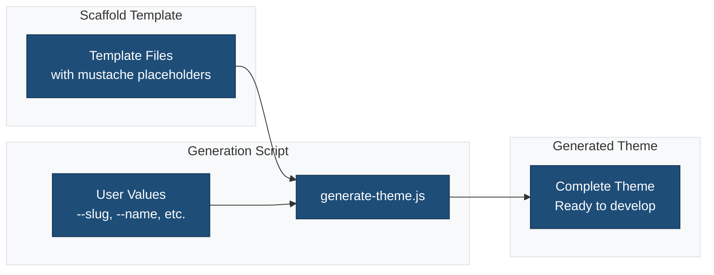
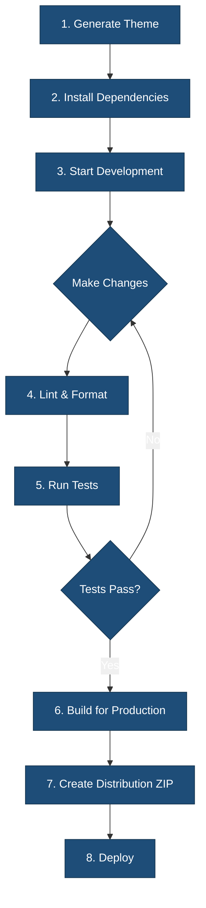

# Theme Generation & Build Scripts

This document explains how to use the scripts in the `bin/` directory to generate, build, and package a new WordPress block theme from this scaffold.

## Overview

The `bin/` directory contains utility scripts for:

- Generating a new theme from the scaffold with custom metadata
- Building the theme for production
- Creating distribution packages
- Initializing a development environment
- Running checks and tests

### Theme Generation Flow



## Scripts

### 1. `generate-theme.js`

Generates a new theme by copying the scaffold and replacing all mustache placeholders with your provided values.

**Usage:**

```sh
node bin/generate-theme.js --slug my-theme --name "My Theme" --description "Description here" --author "Your Name" --author_uri "https://yourdomain.com" --version "1.0.0"
```

- The generated theme will be placed in an `output-theme/` directory in your current working directory.
- All placeholders like `{{theme_slug}}`, `{{theme_name}}`, etc., will be replaced with your values.
- You can safely edit the generated theme independently of the scaffold.

**Arguments:**

- `--slug` (required): Theme slug (e.g., `my-theme`)
- `--name`: Theme display name
- `--description`: Theme description
- `--author`: Author name
- `--author_uri`: Author website
- `--version`: Theme version
- `--theme_uri`: Theme website
- `--min_wp_version`: Minimum WordPress version
- `--tested_wp_version`: Tested up to WordPress version
- `--min_php_version`: Minimum PHP version
- `--license`: License type
- `--license_uri`: License URL
- `--theme_repo_url`: Theme repository URL

### 2. `build.js`

Utility for building, packaging, and checking the theme.

**Usage:**

```sh
node bin/build.js <command> [args]
```

**Commands:**

- `build`     Build theme for production
- `dist`      Create distribution package (ZIP)
- `check`     Run linting and tests
- `init`      Initialize development environment
- `version`   Update theme version (e.g., `node bin/build.js version 1.2.0`)

### 3. `install-wp-tests.sh`

Shell script to set up the WordPress PHPUnit test environment. Used internally for CI and local test setup.

**Usage:**

```sh
bin/install-wp-tests.sh <db-name> <db-user> <db-pass> [db-host] [wp-version] [skip-database-creation]
```

- Downloads and configures the WordPress test suite for PHP unit testing.

## Workflow Example

### Complete Development Workflow



1. Generate a new theme:

   ```sh
   node bin/generate-theme.js --slug my-theme --name "My Theme" --description "A custom block theme" --author "Jane Doe"
   ```

2. Enter the generated theme directory:

   ```sh
   cd output-theme
   ```

3. Install dependencies and initialize:

   ```sh
   node bin/build.js init
   ```

4. Build for production:

   ```sh
   node bin/build.js build
   ```

5. Create a ZIP for distribution:

   ```sh
   node bin/build.js dist
   ```

6. Run checks and tests:

   ```sh
   node bin/build.js check
   ```

## Notes

- The `build.js` script expects a valid `package.json` and `style.css` in the theme root.
- The `generate-theme.js` script will not overwrite an existing `output-theme/` directory.
- For advanced usage, see comments in each script.

---

For more details, see the inline documentation in each script in the `bin/` directory.
