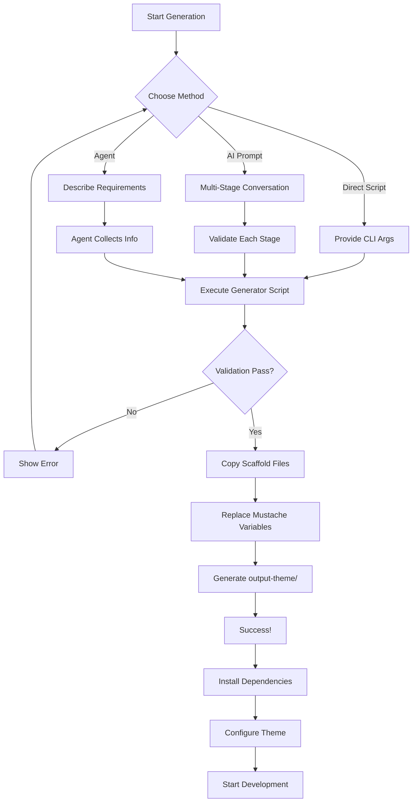

This document explains the complete generator system for creating WordPress block themes from this scaffold, including how mustache template variables are implemented and used throughout the codebase.

## Overview

The Block Theme Scaffold includes a comprehensive generator system with three main components:

1. **Generator Script** (`bin/generate-theme.js`) - Executable CLI script that performs theme generation
2. **Generator Prompt** (`.github/prompts/generate-theme.prompt.md`) - AI-assisted generation workflow
3. **Generator Agent** (`.github/agents/scaffold-generator.agent.md`) - Interactive agent specification

All three methods use **mustache template variables** to create customized themes from the scaffold template.

## Mustache Template System

### What Are Mustache Variables?

Mustache variables are placeholders in template files that get replaced with user-provided values during theme generation. They use the syntax `{{variable_name}}` and appear throughout the scaffold codebase.

**Example:**

```php
// Template file (scaffold):
function {{theme_slug}}_setup() {
    load_theme_textdomain( '{{theme_slug}}', get_template_directory() . '/languages' );
}

// Generated file (after replacement):
function tour_starter_setup() {
    load_theme_textdomain( 'tour-starter', get_template_directory() . '/languages' );
}
```

### Why Mustache?

- **Simple syntax**: Easy to read and write (`{{variable}}`)
- **Language agnostic**: Works in PHP, CSS, JSON, JavaScript, Markdown, etc.
- **Safe**: No code execution, just string replacement
- **Maintainable**: Clear separation between template and values
- **Flexible**: Supports basic transformations (e.g., `{{theme_slug|upper}}`)

### How The Replacement Works

The generator script (`bin/generate-theme.js`) performs three main operations:

1. **User Input Collection** - Gather values via CLI arguments
2. **Value Sanitization** - Validate and sanitize all inputs for security
3. **File Processing** - Copy scaffold files and replace all mustache variables

```javascript
// Simplified example from generate-theme.js
const placeholders = {
    '{{theme_slug}}': 'my-theme',
    '{{theme_name}}': 'My Theme',
    '{{author}}': 'John Doe',
    // ... more variables
};

function replacePlaceholders(content) {
    let result = content;
    for (const [key, value] of Object.entries(placeholders)) {
        result = result.split(key).join(value);
    }
    return result;
}
```

### Complete Variable Reference

The generator supports these mustache variables throughout the scaffold:

#### Core Identity Variables

| Variable | Type | Description | Example | Used In |
|----------|------|-------------|---------|---------|
| `{{theme_slug}}` | slug | URL-safe theme identifier (lowercase, hyphens only) | `tour-starter` | All files |
| `{{theme_name}}` | text | Human-readable theme display name | `Tour Starter Theme` | style.css, theme.json, PHP, JS |
| `{{namespace}}` | slug | PHP namespace (underscored theme_slug) | `tour_starter` | functions.php, PHP files |
| `{{description}}` | text | One or two sentence theme description | `A modern WordPress block theme for tour operators` | style.css, README.txt, package.json |

#### Author & Contact Variables

| Variable | Type | Description | Example | Used In |
|----------|------|-------------|---------|---------|
| `{{author}}` | text | Theme author name | `LightSpeed` | style.css, package.json, README.txt |
| `{{author_uri}}` | url | Author website URL | `https://developer.lsdev.biz` | style.css, package.json |
| `{{author_username}}` | text | WordPress.org username | `lightspeed-wp` | README.txt |
| `{{support_email}}` | email | Support contact email | `support@example.com` | SUPPORT.md |
| `{{security_email}}` | email | Security issues contact | `security@example.com` | SECURITY.md |
| `{{business_email}}` | email | Business inquiries contact | `contact@example.com` | Documentation |

#### Version & Compatibility Variables

| Variable | Type | Description | Example | Used In |
|----------|------|-------------|---------|---------|
| `{{version}}` | semver | Theme version number | `1.0.0` | style.css, package.json, functions.php |
| `{{min_wp_version}}` | version | Minimum WordPress version | `6.5` | style.css, README.txt |
| `{{tested_wp_version}}` | version | Tested up to WordPress version | `6.7` | style.css, README.txt |
| `{{min_php_version}}` | version | Minimum PHP version required | `8.0` | style.css, composer.json |
| `{{year}}` | number | Copyright year | `2025` | style.css, LICENSE |
| `{{created_date}}` | date | Theme creation date | `2025-12-05` | package.json |
| `{{updated_date}}` | date | Last update date | `2025-12-05` | package.json |

#### URLs & Links Variables

| Variable | Type | Description | Example | Used In |
|----------|------|-------------|---------|---------|
| `{{theme_uri}}` | url | Theme homepage URL | `https://example.com/theme` | style.css, package.json |
| `{{theme_repo_url}}` | url | GitHub/Git repository URL | `https://github.com/user/theme` | package.json, docs |
| `{{docs_url}}` | url | Documentation website | `https://github.com/user/theme/wiki` | README.txt, SUPPORT.md |
| `{{support_url}}` | url | Support forum URL | `https://wordpress.org/support/theme/slug` | README.txt |
| `{{changelog_url}}` | url | Changelog URL | `https://github.com/user/theme/releases` | package.json |
| `{{discord_url}}` | url | Discord community link | `https://discord.gg/example` | SUPPORT.md |
| `{{premium_support_url}}` | url | Premium support page | `https://example.com/support` | SUPPORT.md |

#### License Variables

| Variable | Type | Description | Example | Used In |
|----------|------|-------------|---------|---------|
| `{{license}}` | identifier | SPDX license identifier | `GPL-2.0-or-later` | style.css, package.json |
| `{{license_uri}}` | url | License text URL | `https://www.gnu.org/licenses/gpl-2.0.html` | style.css |

#### Design System Variables (theme.json)

| Variable | Type | Description | Example | Used In |
|----------|------|-------------|---------|---------|
| `{{primary_color}}` | hex | Primary brand color | `#0073aa` | theme.json |
| `{{secondary_color}}` | hex | Secondary brand color | `#005177` | theme.json |
| `{{background_color}}` | hex | Default background color | `#ffffff` | theme.json |
| `{{text_color}}` | hex | Default text color | `#1a1a1a` | theme.json |
| `{{accent_color}}` | hex | Accent/highlight color | `#ff6b35` | theme.json |
| `{{neutral_color}}` | hex | Neutral/gray color | `#6c757d` | theme.json |

#### Typography Variables (theme.json)

| Variable | Type | Description | Example | Used In |
|----------|------|-------------|---------|---------|
| `{{heading_font_family}}` | css | CSS font stack for headings | `"Poppins", sans-serif` | theme.json |
| `{{heading_font_name}}` | text | Display name for heading font | `Poppins` | theme.json |
| `{{body_font_family}}` | css | CSS font stack for body | `"Inter", sans-serif` | theme.json |
| `{{body_font_name}}` | text | Display name for body font | `Inter` | theme.json |
| `{{mono_font_family}}` | css | CSS font stack for code | `"Fira Code", monospace` | theme.json |
| `{{mono_font_name}}` | text | Display name for mono font | `Fira Code` | theme.json |
| `{{heading_font_weight}}` | number | Font weight for headings | `700` | theme.json |
| `{{body_line_height}}` | number | Line height for body text | `1.6` | theme.json |
| `{{heading_line_height}}` | number | Line height for headings | `1.2` | theme.json |
| `{{button_font_weight}}` | number | Font weight for buttons | `600` | theme.json |
| `{{site_title_font_weight}}` | number | Font weight for site title | `700` | theme.json |

#### Layout Variables (theme.json)

| Variable | Type | Description | Example | Used In |
|----------|------|-------------|---------|---------|
| `{{content_width}}` | css | Max width for content | `720px` | theme.json |
| `{{wide_width}}` | css | Max width for wide blocks | `1200px` | theme.json |
| `{{content_width_px}}` | number | Content width in pixels (no unit) | `720` | functions.php |

#### UI Component Variables

| Variable | Type | Description | Example | Used In |
|----------|------|-------------|---------|---------|
| `{{button_border_radius}}` | css | Border radius for buttons | `4px` | theme.json |

#### Content Variables

| Variable | Type | Description | Example | Used In |
|----------|------|-------------|---------|---------|
| `{{theme_tags}}` | csv | WordPress theme tags | `blog, custom-header, featured-images` | style.css, README.txt |
| `{{target_audience}}` | text | Target user description | `tour operators and travel agencies` | README.txt |
| `{{textdomain}}` | slug | WordPress text domain (same as theme_slug) | `tour-starter` | PHP files, README.txt |
| `{{skip_link_text}}` | text | Skip navigation link text | `Skip to content` | theme.js |
| `{{excerpt_length}}` | number | Default excerpt word count | `55` | functions.php |
| `{{excerpt_more}}` | text | Excerpt "more" text | `...` | functions.php |

#### Image Size Variables

| Variable | Type | Description | Example | Used In |
|----------|------|-------------|---------|---------|
| `{{featured_image_width}}` | number | Featured image width in pixels | `1200` | functions.php |
| `{{featured_image_height}}` | number | Featured image height in pixels | `675` | functions.php |
| `{{thumbnail_width}}` | number | Thumbnail width in pixels | `300` | functions.php |
| `{{thumbnail_height}}` | number | Thumbnail height in pixels | `300` | functions.php |
| `{{gallery_image_width}}` | number | Gallery image width in pixels | `800` | functions.php |
| `{{gallery_image_height}}` | number | Gallery image height in pixels | `600` | functions.php |

### Variable Transformations

Some variables support transformations using the pipe (`|`) syntax:

| Transformation | Description | Example |
|----------------|-------------|---------|
| `{{theme_slug\|upper}}` | Convert to uppercase | `TOUR_STARTER` |

**Usage in PHP:**

```php
define( '{{theme_slug|upper}}_VERSION', '{{version}}' );
// Generates:
define( 'TOUR_STARTER_VERSION', '1.0.0' );
```

**Note:** The generator script currently implements simple string replacement. Advanced transformations may require custom implementation.

## Where Variables Are Used

### File Type Usage Matrix

| File Type | Primary Variables | Common Use Cases |
|-----------|------------------|------------------|
| **PHP Files** | `theme_slug`, `namespace`, `theme_name`, `version` | Function names, constants, text domains, translations |
| **CSS Files** | `theme_name`, `author`, `version`, `license` | File headers, comments |
| **JSON Files** | `theme_slug`, design system variables | theme.json configuration, package.json metadata |
| **JavaScript** | `theme_slug`, `theme_name` | Script names, text domains, i18n |
| **Markdown** | All variables | Documentation, README files |
| **Template Files** | `theme_slug` | Pattern registration, template references |

### Specific File Examples

#### style.css

```css
/*
Theme Name: {{theme_name}}
Theme URI: {{theme_uri}}
Author: {{author}}
Author URI: {{author_uri}}
Description: {{description}}
Version: {{version}}
Requires at least: {{min_wp_version}}
Tested up to: {{tested_wp_version}}
Requires PHP: {{min_php_version}}
License: {{license}}
License URI: {{license_uri}}
Text Domain: {{theme_slug}}
Tags: {{theme_tags}}
*/
```

#### functions.php

```php
<?php
/**
 * Functions and definitions for {{theme_name}}
 *
 * @package {{theme_name}}
 * @since {{version}}
 */

define( '{{theme_slug|upper}}_VERSION', '{{version}}' );

function {{theme_slug}}_setup() {
    load_theme_textdomain( '{{theme_slug}}', get_template_directory() . '/languages' );
}
add_action( 'after_setup_theme', '{{theme_slug}}_setup' );
```

#### theme.json

```json
{
  "settings": {
    "color": {
      "palette": [
        {
          "slug": "primary",
          "color": "{{primary_color}}",
          "name": "Primary"
        }
      ]
    },
    "typography": {
      "fontFamilies": [
        {
          "fontFamily": "{{heading_font_family}}",
          "slug": "heading",
          "name": "{{heading_font_name}}"
        }
      ]
    },
    "layout": {
      "contentSize": "{{content_width}}",
      "wideSize": "{{wide_width}}"
    }
  }
}
```

#### package.json

```json
{
  "name": "{{theme_slug}}",
  "version": "{{version}}",
  "description": "{{description}}",
  "author": "{{author}}",
  "license": "{{license}}",
  "homepage": "{{theme_uri}}",
  "repository": {
    "type": "git",
    "url": "{{theme_repo_url}}"
  }
}
```

#### JavaScript (theme.js, editor.js)

```javascript
import { __ } from '@wordpress/i18n';

const skipLink = document.createElement('a');
skipLink.textContent = __( '{{skip_link_text}}', '{{theme_slug}}' );

wp.blocks.registerBlockStyle( 'core/button', {
    name: '{{theme_slug}}-primary',
    label: __( 'Primary Button', '{{theme_slug}}' )
});
```

## Generator System Components

### 1. Generator Script (`bin/generate-theme.js`)

The core implementation that performs the actual theme generation.

**Features:**

- Interactive CLI with command-line arguments
- Input validation and sanitization for security
- Recursive file copying with mustache replacement
- Exclusion of development files (node_modules, .git, etc.)
- Error handling with descriptive messages

**Security Features:**

- Sanitizes all user inputs by type (slug, name, URL, version, etc.)
- Prevents path traversal attacks
- Validates URL protocols (only http/https)
- Enforces semver version format
- Removes control characters and null bytes

**Usage:**

```bash
node bin/generate-theme.js \
  --slug "tour-starter" \
  --name "Tour Starter Theme" \
  --description "A modern WordPress block theme for tour operators" \
  --author "LightSpeed" \
  --author_uri "https://developer.lsdev.biz" \
  --version "1.0.0" \
  --min_wp_version "6.5" \
  --tested_wp_version "6.7" \
  --min_php_version "8.0"
```

**Required Arguments:**

- `--slug` - Theme slug (URL-safe identifier)
- `--name` - Theme display name

**Optional Arguments (with defaults):**

- `--description` - Theme description (default: "A WordPress block theme.")
- `--author` - Author name (default: "Author Name")
- `--author_uri` - Author URL (default: `https://example.com`)
- `--version` - Version number (default: "1.0.0")
- `--theme_uri` - Theme URL (default: `https://example.com/theme`)
- `--min_wp_version` - Min WordPress version (default: "6.0")
- `--tested_wp_version` - Tested WordPress version (default: "6.5")
- `--min_php_version` - Min PHP version (default: "7.4")
- `--license` - License type (default: "GPL-2.0-or-later")
- `--license_uri` - License URL (default: GPL URL)
- `--theme_repo_url` - Repository URL (default: generated from author/slug)

**Generated Output:**

- Creates `output-theme/` directory in current working directory
- Copies all scaffold files except excluded directories
- Replaces all mustache variables with provided values
- Preserves file structure and permissions

### 2. Generator Prompt (`.github/prompts/generate-theme.prompt.md`)

AI-assisted workflow for interactive theme generation through conversation.

**Features:**

- Multi-stage information gathering
- Contextual help and examples
- Validation at each stage
- Default value suggestions
- Clear progression through steps

**Stages:**

1. **Basic Theme Identity** - Core metadata (name, slug, description, author)
2. **Version & Compatibility** - WordPress/PHP version requirements
3. **Design Tokens** - Colors, fonts, and typography
4. **Initial Content** - Hero text, CTAs, footer text

**Usage:**

```text
@workspace /generate-theme
```

The AI assistant will guide you through each stage, collecting information and validating inputs before generating the theme.

### 3. Generator Agent (`.github/agents/scaffold-generator.agent.md`)

Interactive agent specification for autonomous theme generation.

**Features:**

- Conversation-driven workflow
- Automatic validation
- Error recovery
- Integration with generator script
- Post-generation assistance

**Usage:**

```text
Generate a new block theme from scaffold
```

The agent follows the specification to autonomously collect requirements and execute generation.

## Usage Options

You can generate a new theme using any of these three methods:

### Option 1: Direct Script Execution (Fastest)

Best for: Automated workflows, CI/CD, batch operations

```bash
cd /path/to/block-theme-scaffold
node bin/generate-theme.js --slug my-theme --name "My Theme"
```

**Pros:**

- Fastest method
- Scriptable and automatable
- No dependencies on AI services
- Complete control over all parameters

**Cons:**

- Requires knowing all parameter names
- No interactive guidance
- Must provide values upfront

### Option 2: AI Prompt-Based (Recommended for First-Time Users)

Best for: Learning, exploration, guided setup

```text
@workspace /generate-theme
```

**Pros:**

- Interactive guidance through each stage
- Contextual help and examples
- Validates inputs as you go
- Suggests sensible defaults
- Explains each parameter

**Cons:**

- Requires AI assistant (Copilot)
- Slower than direct script
- Multiple conversational turns

### Option 3: Agent-Based (Best for Complex Requirements)

Best for: Custom requirements, advanced configuration, learning the system

```text
Generate a new block theme for a tour operator website
```

**Pros:**

- Autonomous operation
- Handles complex requirements
- Can infer values from context
- Post-generation assistance
- Integration with other agents

**Cons:**

- Requires AI agent support
- May ask clarifying questions
- Slightly more complex workflow

## Complete Workflow Example

### Step-by-Step Generation

Let's create a theme for a tour operator using the prompt-based method:

**1. Initiate Generation:**

```text
@workspace /generate-theme
```

**2. Provide Stage 1 Information:**

```text
1. Tour Starter Theme
2. tour-starter
3. A modern WordPress block theme designed for tour operators and travel agencies
4. LightSpeed
5. https://developer.lsdev.biz
```

**3. Confirm Stage 2 (or customize):**

```text
yes
```

(Accepts defaults: version 1.0.0, WP 6.5+, tested 6.7, PHP 8.0+)

**4. Provide Stage 3 Design Tokens:**

```text
1. #0073aa (blue)
2. #005177 (dark blue)
3. #ffffff (white)
4. #1a1a1a (near black)
5. "Inter", -apple-system, BlinkMacSystemFont, "Segoe UI", sans-serif
6. "Poppins", "Inter", sans-serif
```

**5. Provide Stage 4 Content (optional):**

```text
1. Discover Your Next Adventure
2. Book Now
3. © 2025 Tour Starter. All rights reserved.
```

**6. Generator Executes:**

```bash
node bin/generate-theme.js \
  --slug "tour-starter" \
  --name "Tour Starter Theme" \
  --description "A modern WordPress block theme designed for tour operators and travel agencies" \
  --author "LightSpeed" \
  --author_uri "https://developer.lsdev.biz" \
  --version "1.0.0"
```

**7. Theme Generated Successfully:**

```text
Theme generated at /path/to/output-theme
```

### Post-Generation Setup

After generation, follow these steps to start developing:

**1. Navigate to Generated Theme:**

```bash
cd output-theme
```

**2. Review Generated Files:**

```bash
# Check that variables were replaced correctly
cat style.css
cat functions.php
cat package.json
```

**3. Install Dependencies:**

```bash
npm install
composer install
```

**4. Configure theme.json (if needed):**

Edit `theme.json` to customize:

- Color palette beyond provided values
- Additional font sizes
- Custom spacing scale
- Block-specific settings

**5. Start Development Server:**

```bash
npm run start
```

**6. Begin Theme Development:**

- Create custom patterns in `patterns/`
- Add template parts in `parts/`
- Build templates in `templates/`
- Add custom styles in `src/css/`
- Develop JavaScript features in `src/js/`

### Theme Generation Flow Diagram



## Build System Integration

The generated theme includes a complete build system:

### Build Scripts (`bin/build.js`)

Utility for building, packaging, and checking the theme.

**Usage:**

```bash
node bin/build.js <command> [args]
```

**Commands:**

- `build` - Build theme for production (minifies CSS/JS, optimizes assets)
- `dist` - Create distribution package (ZIP file ready for WordPress.org)
- `check` - Run all linters and tests
- `init` - Initialize development environment (install dependencies)
- `version` - Update theme version across all files

**Examples:**

```bash
# Build for production
node bin/build.js build

# Create distribution ZIP
node bin/build.js dist

# Run all checks
node bin/build.js check

# Update version to 1.2.0
node bin/build.js version 1.2.0

# Initialize new project
node bin/build.js init
```

### npm Scripts

The generated `package.json` includes these scripts:

| Script | Command | Purpose |
|--------|---------|---------|
| `npm run start` | Development mode | Watch files, rebuild on changes |
| `npm run build` | Production build | Minify and optimize for production |
| `npm run lint` | Run all linters | Check JS, CSS, and PHP |
| `npm run lint:fix` | Auto-fix issues | Fix linting errors automatically |
| `npm run test` | Run all tests | Execute PHP and JS tests |
| `npm run makepot` | Generate POT file | Extract translatable strings |
| `npm run i18n` | Full i18n process | Generate POT and JSON files |

### Test Scripts

The scaffold includes comprehensive testing:

```bash
# PHP Unit Tests
npm run test:php

# JavaScript Unit Tests
npm run test:js
npm run test:js:watch  # Watch mode

# End-to-End Tests
npm run test:e2e
npm run test:e2e:a11y  # Accessibility tests only

# Template Validation
npm run test:templates

# theme.json Validation
npm run test:theme-json
```

### WordPress Test Suite Setup (`bin/install-wp-tests.sh`)

Shell script to set up the WordPress PHPUnit test environment.

**Usage:**

```bash
bin/install-wp-tests.sh <db-name> <db-user> <db-pass> [db-host] [wp-version] [skip-database-creation]
```

**Example:**

```bash
bin/install-wp-tests.sh wordpress_test root '' localhost latest
```

Downloads and configures the WordPress test suite for PHP unit testing.

## Best Practices

### Variable Naming Conventions

When working with mustache variables:

1. **Use lowercase with underscores** - `{{theme_slug}}`, not `{{ThemeSlug}}`
2. **Be descriptive** - `{{primary_color}}` is better than `{{color1}}`
3. **Follow patterns** - Colors end with `_color`, fonts with `_font_family`, etc.
4. **Maintain consistency** - If you add new variables, follow existing patterns

### Adding New Variables

If you need to add a custom variable to the scaffold:

**1. Add to `generate-theme.js` placeholders:**

```javascript
const placeholders = {
    // ... existing variables
    '{{custom_variable}}': sanitizeInput(argMap.custom_variable, 'text') || 'default value',
};
```

**2. Add to command-line arguments:**

The script automatically reads `--custom_variable` from CLI args.

**3. Use in template files:**

```php
// In any scaffold file:
function {{theme_slug}}_custom() {
    return '{{custom_variable}}';
}
```

**4. Document in this file:**

Add to the variable reference table above.

**5. Update prompt and agent:**

Add to `.github/prompts/generate-theme.prompt.md` and agent specification.

### Security Considerations

**Always sanitize user inputs:**

The generator includes type-specific sanitization:

- `slug` - Only lowercase letters, numbers, hyphens
- `name` - Alphanumeric and common punctuation
- `url` - Valid http/https URLs only
- `version` - Semantic versioning format
- `text` - No HTML/script tags

**Never use user input directly in:**

- SQL queries (use prepared statements)
- System commands (validate and escape)
- HTML output (escape with `esc_html()`)
- URLs (escape with `esc_url()`)

### Testing Generated Themes

After generating a theme, always:

1. **Run all linters:**

   ```bash
   npm run lint
   ```

2. **Run all tests:**

   ```bash
   npm run test
   ```

3. **Validate theme.json:**

   ```bash
   npm run test:theme-json
   ```

4. **Check accessibility:**

   ```bash
   npm run test:e2e:a11y
   ```

5. **Manual testing:**
   - Install in WordPress
   - Activate and check for errors
   - Test with Block Editor
   - Try all templates and patterns
   - Check responsive design
   - Validate with Theme Check plugin

## Troubleshooting

### Common Issues

#### 1. "Output directory already exists"

```bash
# Remove existing output directory
rm -rf output-theme
# Or specify a different location
cd /path/to/different/location
node /path/to/scaffold/bin/generate-theme.js --slug my-theme
```

#### 2. "Invalid slug provided"

Slug must:

- Be at least 2 characters long
- Contain only lowercase letters, numbers, and hyphens
- Not start or end with a hyphen

Valid: `my-theme`, `tour-operator-2024`
Invalid: `My Theme`, `theme_slug`, `-theme-`

#### 3. "Invalid URL format"

URLs must:

- Include protocol (`http://` or `https://`)
- Be properly formatted

Valid: `https://example.com`
Invalid: `example.com`, `ftp://example.com`

#### 4. Variables not replaced in generated files

Check that:

- Variable names exactly match template (case-sensitive)
- Double curly braces are used: `{{variable}}`, not `{variable}`
- No extra spaces: `{{theme_slug}}`, not `{{ theme_slug }}`

#### 5. Build fails after generation

```bash
# Clean install dependencies
rm -rf node_modules package-lock.json
npm install

# Clear build cache
rm -rf build
npm run build
```

### Validation Errors

If generation fails with validation errors:

**Check your inputs match these formats:**

- **Slug:** `^[a-z0-9-]{2,}$`
- **Version:** `^\d+\.\d+(\.\d+)?(-[a-zA-Z0-9.-]+)?$`
- **URL:** Must parse as valid URL with http/https
- **Email:** Basic format validation

### Getting Help

**Resources:**

1. **Documentation:**
   - [Development Guide](DEVELOPMENT.md)
   - [Build Process](BUILD-PROCESS.md)
   - [Generator System](GENERATOR-SYSTEM.md) (this file)

2. **Code Examples:**
   - Review the scaffold source files
   - Check `tests/` directory for examples
   - Look at `patterns/` for pattern examples

3. **Support:**
   - GitHub Issues: Report bugs or request features
   - Discussions: Ask questions about usage
   - Documentation: Check all docs in `docs/` directory

## Advanced Usage

### Custom Template Transformations

For advanced transformations beyond simple replacement, you can extend the generator:

**Add custom transformation functions:**

```javascript
// In generate-theme.js
function transformValue(value, transformation) {
    switch (transformation) {
        case 'upper':
            return value.toUpperCase();
        case 'lower':
            return value.toLowerCase();
        case 'title':
            return value.replace(/\w\S*/g, (txt) =>
                txt.charAt(0).toUpperCase() + txt.substr(1).toLowerCase()
            );
        case 'camel':
            return value.replace(/-([a-z])/g, (g) => g[1].toUpperCase());
        default:
            return value;
    }
}
```

**Use in templates:**

```php
class {{theme_slug|camel}}Theme {
    const VERSION = '{{version}}';
}
```

### Batch Generation

Generate multiple themes from a configuration file:

**Create `themes.json`:**

```json
[
  {
    "slug": "theme-one",
    "name": "Theme One",
    "author": "Author Name"
  },
  {
    "slug": "theme-two",
    "name": "Theme Two",
    "author": "Author Name"
  }
]
```

**Create batch script:**

```bash
#!/bin/bash
while IFS= read -r config; do
    slug=$(echo "$config" | jq -r '.slug')
    name=$(echo "$config" | jq -r '.name')
    author=$(echo "$config" | jq -r '.author')

    node bin/generate-theme.js \
        --slug "$slug" \
        --name "$name" \
        --author "$author"

    mv output-theme "$slug"
done < <(jq -c '.[]' themes.json)
```

### CI/CD Integration

Automate theme generation in your CI/CD pipeline:

**GitHub Actions example:**

```yaml
name: Generate Theme
on:
  workflow_dispatch:
    inputs:
      theme_slug:
        description: 'Theme slug'
        required: true
      theme_name:
        description: 'Theme name'
        required: true

jobs:
  generate:
    runs-on: ubuntu-latest
    steps:
      - uses: actions/checkout@v3

      - name: Setup Node
        uses: actions/setup-node@v3
        with:
          node-version: '18'

      - name: Generate Theme
        run: |
          node bin/generate-theme.js \
            --slug "${{ github.event.inputs.theme_slug }}" \
            --name "${{ github.event.inputs.theme_name }}" \
            --author "${{ github.repository_owner }}"

      - name: Create ZIP
        run: |
          cd output-theme
          zip -r ../theme.zip .

      - name: Upload Artifact
        uses: actions/upload-artifact@v3
        with:
          name: generated-theme
          path: theme.zip
```

## Related Documentation

- [Development Guide](DEVELOPMENT.md) - General development workflow
- [Build Process](BUILD-PROCESS.md) - Detailed build system documentation
- [Testing Guide](TESTING.md) - Comprehensive testing documentation
- [Theme JSON Guide](../instructions/theme-json.instructions.md) - theme.json configuration
- [Pattern Development](../instructions/pattern-development.instructions.md) - Creating block patterns
- [Coding Standards](../instructions/coding-standards.instructions.md) - Code style guidelines

## Version History

- **v1.0.0** (2025-12-05) - Merged generator system documentation with complete mustache variable reference
- Added comprehensive variable tables and usage examples
- Documented all three generation methods
- Added troubleshooting and advanced usage sections
- Integrated build system documentation

---

For more information about the scaffold and development workflow, see the main [README.md](../README.md).

### Theme Generation Flow


## Scripts

### 1. `generate-theme.js`

Generates a new theme by copying the scaffold and replacing all mustache placeholders with your provided values.

**Usage:**

```sh
node bin/generate-theme.js --slug my-theme --name "My Theme" --description "Description here" --author "Your Name" --author_uri "https://yourdomain.com" --version "1.0.0"
```

- The generated theme will be placed in an `output-theme/` directory in your current working directory.
- All placeholders like `{{theme_slug}}`, `{{theme_name}}`, etc., will be replaced with your values.
- You can safely edit the generated theme independently of the scaffold.

**Arguments:**

- `--slug` (required): Theme slug (e.g., `my-theme`)
- `--name`: Theme display name
- `--description`: Theme description
- `--author`: Author name
- `--author_uri`: Author website
- `--version`: Theme version
- `--theme_uri`: Theme website
- `--min_wp_version`: Minimum WordPress version
- `--tested_wp_version`: Tested up to WordPress version
- `--min_php_version`: Minimum PHP version
- `--license`: License type
- `--license_uri`: License URL
- `--theme_repo_url`: Theme repository URL

### 2. `build.js`

Utility for building, packaging, and checking the theme.

**Usage:**

```sh
node bin/build.js <command> [args]
```

**Commands:**

- `build`     Build theme for production
- `dist`      Create distribution package (ZIP)
- `check`     Run linting and tests
- `init`      Initialize development environment
- `version`   Update theme version (e.g., `node bin/build.js version 1.2.0`)

### 3. `install-wp-tests.sh`

Shell script to set up the WordPress PHPUnit test environment. Used internally for CI and local test setup.

**Usage:**

```sh
bin/install-wp-tests.sh <db-name> <db-user> <db-pass> [db-host] [wp-version] [skip-database-creation]
```

- Downloads and configures the WordPress test suite for PHP unit testing.

## Workflow Example

### Complete Development Workflow


1. Generate a new theme:

   ```sh
   node bin/generate-theme.js --slug my-theme --name "My Theme" --description "A custom block theme" --author "Jane Doe"
   ```

2. Enter the generated theme directory:

   ```sh
   cd output-theme
   ```

3. Install dependencies and initialize:

   ```sh
   node bin/build.js init
   ```

4. Build for production:

   ```sh
   node bin/build.js build
   ```

5. Create a ZIP for distribution:

   ```sh
   node bin/build.js dist
   ```

6. Run checks and tests:

   ```sh
   node bin/build.js check
   ```

## Notes

- The `build.js` script expects a valid `package.json` and `style.css` in the theme root.
- The `generate-theme.js` script will not overwrite an existing `output-theme/` directory.
- For advanced usage, see comments in each script.

---

For more details, see the inline documentation in each script in the `bin/` directory.
