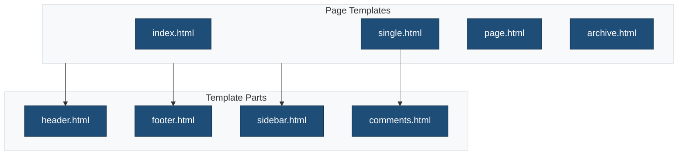
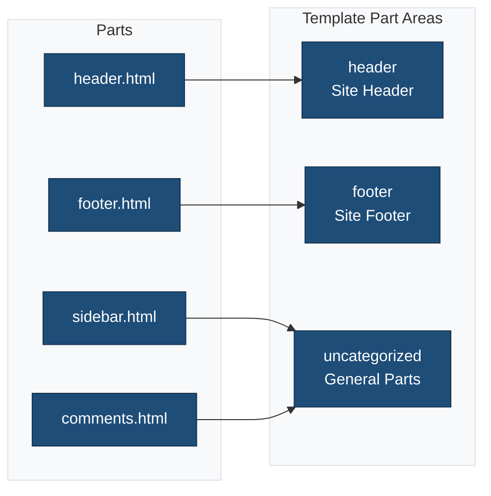

# Template Parts

This directory contains reusable template parts for the block theme.

## Overview



## Template Parts

### `header.html`

The site header containing logo, site title, and navigation.

**Block Structure:**

```
└── Group (Header)
    ├── Site Logo
    ├── Site Title
    └── Navigation
```

**Usage in templates:**

```html
<!-- wp:template-part {"slug":"header","tagName":"header"} /-->
```

### `footer.html`

The site footer with copyright and secondary navigation.

**Block Structure:**

```
└── Group (Footer)
    ├── Site Title
    ├── Paragraph (Copyright)
    └── Navigation (Footer Menu)
```

**Usage in templates:**

```html
<!-- wp:template-part {"slug":"footer","tagName":"footer"} /-->
```

### `sidebar.html`

Optional sidebar for widget areas.

**Block Structure:**

```
└── Group (Sidebar)
    ├── Heading
    ├── Categories
    ├── Recent Posts
    └── Tag Cloud
```

**Usage in templates:**

```html
<!-- wp:template-part {"slug":"sidebar"} /-->
```

### `comments.html`

Comments section for posts and pages.

**Block Structure:**

```
└── Comments
    ├── Comments Title
    ├── Comment Template
    ├── Comments Pagination
    └── Post Comments Form
```

**Usage in templates:**

```html
<!-- wp:template-part {"slug":"comments"} /-->
```

## Template Part Areas

Template parts are registered in `theme.json`:

```json
{
  "templateParts": [
    {
      "name": "header",
      "title": "Header",
      "area": "header"
    },
    {
      "name": "footer",
      "title": "Footer",
      "area": "footer"
    },
    {
      "name": "sidebar",
      "title": "Sidebar",
      "area": "uncategorized"
    },
    {
      "name": "comments",
      "title": "Comments",
      "area": "uncategorized"
    }
  ]
}
```

## Part Areas



## Creating New Template Parts

1. Create an HTML file in this directory
2. Add block markup using WordPress block syntax
3. Register the part in `theme.json`

**Example new part:**

```html
<!-- wp:group {"layout":{"type":"constrained"}} -->
<div class="wp-block-group">
    <!-- wp:heading -->
    <h2>Related Posts</h2>
    <!-- /wp:heading -->

    <!-- wp:query {"queryId":1,"query":{"perPage":3}} -->
    <!-- wp:post-template -->
    <!-- wp:post-title /-->
    <!-- /wp:post-template -->
    <!-- /wp:query -->
</div>
<!-- /wp:group -->
```

## Related Documentation

- [Templates](../templates/README.md)
- [Block Theme Template Parts](https://developer.wordpress.org/themes/templates/template-parts/)
- [theme.json Reference](https://developer.wordpress.org/themes/global-settings-and-styles/theme-json-reference/)
