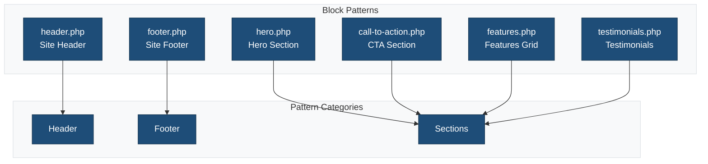
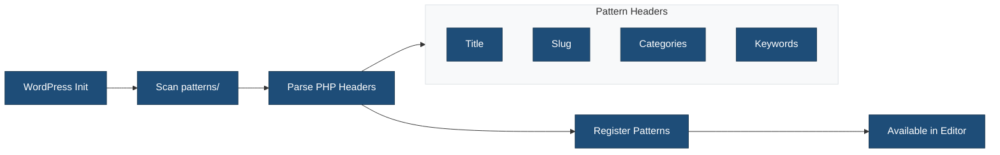

# Block Patterns

This directory contains PHP-based block patterns for the theme.

## Overview



## Patterns

### Layout Patterns

| Pattern | File | Description |
|---------|------|-------------|
| Header | `header.php` | Main site header with logo and navigation |
| Footer | `footer.php` | Site footer with links and copyright |

### Section Patterns

| Pattern | File | Description |
|---------|------|-------------|
| Hero | `hero.php` | Hero section with heading and CTA |
| Call to Action | `call-to-action.php` | Conversion-focused section |
| Features | `features.php` | Feature grid with icons |
| Testimonials | `testimonials.php` | Customer testimonials |

## Pattern Structure

Each pattern file uses PHP with WordPress block markup:

```php
<?php
/**
 * Title: Pattern Name
 * Slug: {{theme_slug}}/pattern-name
 * Categories: {{theme_slug}}-sections
 * Keywords: keyword1, keyword2
 * Description: Pattern description.
 */
?>
<!-- wp:group {"align":"full"} -->
<div class="wp-block-group alignfull">
    <!-- Pattern blocks here -->
</div>
<!-- /wp:group -->
```

## Pattern Registration Flow



## Pattern Categories

Categories are registered in `inc/block-patterns.php`:

```php
register_block_pattern_category(
    '{{theme_slug}}-sections',
    array(
        'label' => __( 'Sections', '{{theme_slug}}' ),
    )
);
```

## Using Patterns

### In Templates

```html
<!-- wp:pattern {"slug":"{{theme_slug}}/hero"} /-->
```

### In Block Editor

1. Open the Inserter (+)
2. Navigate to "Patterns" tab
3. Select the theme's pattern category
4. Click to insert

## Creating New Patterns

1. Create a new PHP file in this directory
2. Add the required header comment block
3. Write the block markup

**Example:**

```php
<?php
/**
 * Title: Newsletter Signup
 * Slug: {{theme_slug}}/newsletter
 * Categories: {{theme_slug}}-sections
 * Keywords: newsletter, email, signup
 * Description: Email newsletter signup form.
 */
?>
<!-- wp:group {"align":"wide","style":{"spacing":{"padding":{"top":"var:preset|spacing|50","bottom":"var:preset|spacing|50"}}}} -->
<div class="wp-block-group alignwide">
    <!-- wp:heading {"textAlign":"center"} -->
    <h2 class="has-text-align-center"><?php esc_html_e( 'Subscribe to Our Newsletter', '{{theme_slug}}' ); ?></h2>
    <!-- /wp:heading -->

    <!-- wp:paragraph {"align":"center"} -->
    <p class="has-text-align-center"><?php esc_html_e( 'Get the latest updates delivered to your inbox.', '{{theme_slug}}' ); ?></p>
    <!-- /wp:paragraph -->
</div>
<!-- /wp:group -->
```

## Internationalization

All text strings in patterns should use translation functions:

```php
<?php esc_html_e( 'Translatable text', '{{theme_slug}}' ); ?>
<?php echo esc_html__( 'Translatable text', '{{theme_slug}}' ); ?>
```

## Related Documentation

- [Theme Includes](../inc/README.md)
- [Block Patterns API](https://developer.wordpress.org/block-editor/reference-guides/block-api/block-patterns/)
- [Creating Block Patterns](https://developer.wordpress.org/themes/features/block-patterns/)
