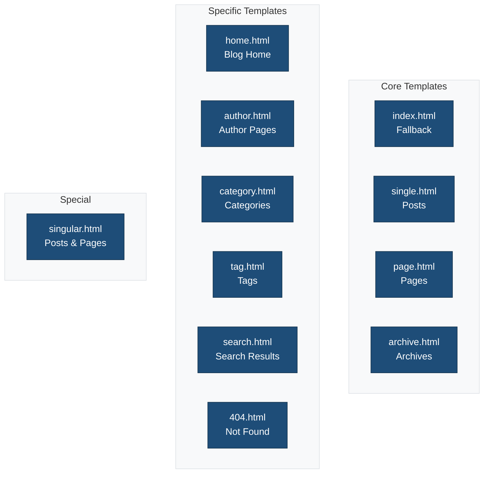
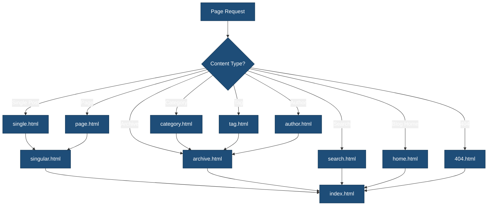

# Templates

This directory contains HTML template files that define the structure of different page types.

## Overview



## Template Hierarchy



## Templates

### Core Templates

| Template | Purpose | Fallback |
|----------|---------|----------|
| `index.html` | Default fallback for all pages | — |
| `single.html` | Individual blog posts | `singular.html` |
| `page.html` | Static pages | `singular.html` |
| `archive.html` | Archive listings | `index.html` |

### Archive Templates

| Template | Purpose | Fallback |
|----------|---------|----------|
| `home.html` | Blog posts page | `index.html` |
| `author.html` | Author archive | `archive.html` |
| `category.html` | Category archive | `archive.html` |
| `tag.html` | Tag archive | `archive.html` |
| `search.html` | Search results | `index.html` |

### Special Templates

| Template | Purpose | Fallback |
|----------|---------|----------|
| `singular.html` | Posts and pages | `index.html` |
| `404.html` | Not found page | `index.html` |

## Template Structure

Each template typically includes:

```html
<!-- wp:template-part {"slug":"header","tagName":"header"} /-->

<!-- wp:group {"tagName":"main"} -->
<main class="wp-block-group">
    <!-- Main content blocks -->
</main>
<!-- /wp:group -->

<!-- wp:template-part {"slug":"footer","tagName":"footer"} /-->
```

## Common Blocks Used

### Query Loop (Archives)

```html
<!-- wp:query {"queryId":1,"query":{"perPage":10,"pages":0,"offset":0,"postType":"post"}} -->
<div class="wp-block-query">
    <!-- wp:post-template -->
        <!-- wp:post-title {"isLink":true} /-->
        <!-- wp:post-excerpt /-->
        <!-- wp:post-date /-->
    <!-- /wp:post-template -->

    <!-- wp:query-pagination -->
        <!-- wp:query-pagination-previous /-->
        <!-- wp:query-pagination-numbers /-->
        <!-- wp:query-pagination-next /-->
    <!-- /wp:query-pagination -->
</div>
<!-- /wp:query -->
```

### Post Content (Single)

```html
<!-- wp:post-title {"level":1} /-->
<!-- wp:post-featured-image /-->
<!-- wp:post-content /-->
<!-- wp:post-terms {"term":"category"} /-->
<!-- wp:post-terms {"term":"post_tag"} /-->
```

## Creating Custom Templates

1. Create an HTML file in this directory
2. Add block markup using WordPress block syntax
3. Register in `theme.json` if needed

**Example: Landing Page Template**

```html
<!-- wp:template-part {"slug":"header"} /-->

<!-- wp:cover {"dimRatio":50,"minHeight":80,"minHeightUnit":"vh"} -->
<div class="wp-block-cover" style="min-height:80vh">
    <!-- Hero content -->
</div>
<!-- /wp:cover -->

<!-- wp:group {"align":"wide"} -->
<div class="wp-block-group alignwide">
    <!-- Page sections -->
</div>
<!-- /wp:group -->

<!-- wp:template-part {"slug":"footer"} /-->
```

## Template Registration

Custom templates can be registered in `theme.json`:

```json
{
    "customTemplates": [
        {
            "name": "landing",
            "title": "Landing Page",
            "postTypes": ["page"]
        }
    ]
}
```

## Related Documentation

- [Template Parts](../parts/README.md)
- [Block Patterns](../patterns/README.md)
- [WordPress Template Hierarchy](https://developer.wordpress.org/themes/templates/template-hierarchy/)
- [Block Theme Templates](https://developer.wordpress.org/themes/templates/)
